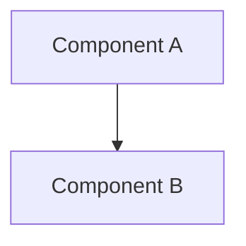
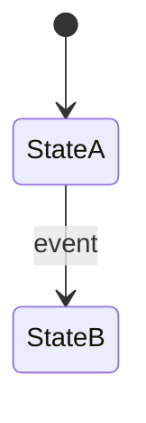

# Kiro Spec Templates

Templates for `.kiro/specs/<feature>/` three-file structure.

## requirements.md Template

```markdown
# Requirements Document

## Introduction

One paragraph: what this feature does, why it matters, and the scope of work.

## Glossary

- **TermA**: Definition used in this spec
- **TermB**: Definition used in this spec

## Requirements

### Requirement 1: Short Title

**User Story:** As a <role>, I want <goal>, so that <benefit>.

#### Acceptance Criteria

1. WHEN <trigger>, THE <system> SHALL <behavior>
2. WHEN <trigger> AND <condition>, THE <system> SHALL <behavior>
3. THE <system> SHALL NOT <prohibited behavior>

### Requirement 2: Short Title

**User Story:** ...

#### Acceptance Criteria

1. ...

## Non-Goals

- What this feature explicitly does NOT solve
- What is deferred to future work
```

## design.md Template

```markdown
# Design Document: <Feature Name>

## Overview

One paragraph summary. Reference any RFCs or ADRs this design implements.

## Architecture

### System Architecture Diagram



### Key Design Decisions

1. **Decision X**: Chose approach Y over Z because <reason>.
2. **Decision Y**: ...

## Components and Interfaces

### 1. Component Name

```zig
pub const Component = struct {
    field: Type,
    pub fn method(self: *Component, arg: Type) !ReturnType { ... }
};
```

**Files to modify/create:** `src/path/to/file.zig`

<!-- sub-doc: design-component-name.md -->
See [Component Name Deep Design](design-component-name.md) for algorithm details.

## Data Models

### Core Data Structures

```zig
const MyStruct = struct {
    id: u64,
    name: []const u8,
};
```

## Correctness Properties

*A property is a characteristic that should hold true across all valid executions.*

### Property 1: Descriptive Name

*For any* <input> and *for any* <condition>, the <component> SHALL <behavior>.

**Validates: Requirements R1.1, R1.2**

## Error Handling

### Error Categories

| Category | Source | Handling Strategy |
|---|---|---|
| ErrorName | `source.zig:line` | Return `error.Name`, log message |

## Testing Strategy

### Test Organization

```
src/tests/
├── <feature>_tests.zig
└── ...
```

### Test Types

- **Unit tests**: Specific examples, edge cases
- **Property tests**: Validate correctness properties with random inputs (min 100 iterations)
```

## tasks.md Template

```markdown
# Implementation Plan: <Feature Name>

## Overview

One paragraph. Link to design.md and requirements.md.

## Tasks

- [ ] 1. Phase Name — Summary
  - [ ] 1.1 Task description
    - Modify `src/file.zig`: add function X
    - _Requirements: R1.1, R1.2_
    - _Validates: Property 1_
  - [ ] 1.2 Task description
    - _Requirements: R1.3_

- [ ] 2. Next Phase
  - [ ] 2.1 ...

## Notes

<!-- NOTE: Implementation divergence tracker -->
<!-- When code diverges from design, add a NOTE here -->
```

## Sub-Document Template (design-<component>.md)

```markdown
# Design: <Component Name>

**Parent**: `design.md` §<section>

## Interface

(Full type signatures)

## Algorithm

(Step-by-step logic, pseudocode, or detailed explanation)

## State Machine

(If applicable)



## Edge Cases

1. **Case X**: When <condition>, handle by <action>
```
