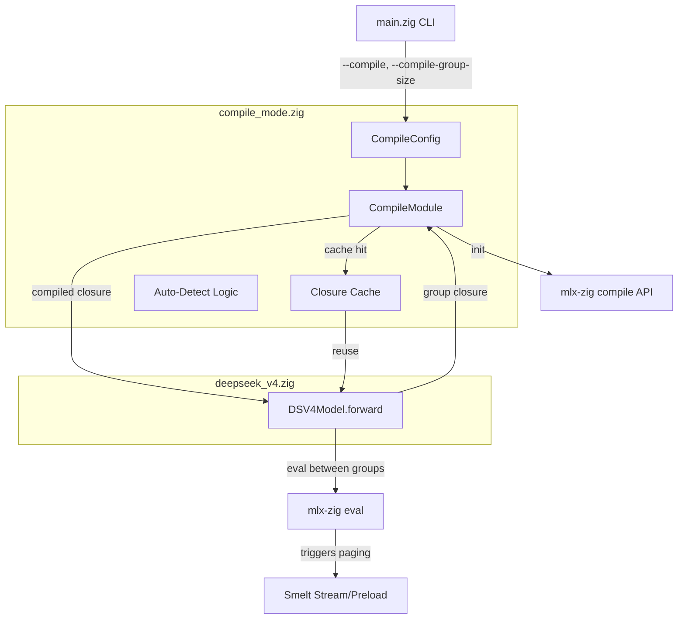
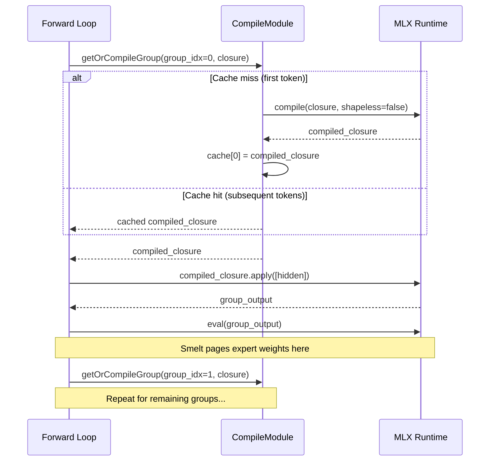

# Design Document: MLX Compile Mode

## Overview

This design adds layer-group MLX graph compilation to dmlx as an opt-in performance mode. The core idea: partition the 43 transformer layers into groups of N, compile each group's forward pass into a single fused MLX closure, and call `eval()` between groups to allow Smelt memory paging.

The implementation introduces a single new module (`src/compile_mode.zig`) that encapsulates all compilation logic, plus minimal modifications to the existing forward loop in `deepseek_v4.zig` and CLI flag parsing in `main.zig`.

**Key design decisions:**
- **Standalone module**: `compile_mode.zig` has no model-specific dependencies — it operates on generic closures
- **Closure wrapping**: The forward loop constructs a closure that captures layer references and state, then passes it to the compile module
- **Cache-on-first-use**: Compiled closures are cached by group index; subsequent tokens reuse the compiled graph
- **Graceful fallback**: If MLX compilation fails for a group, that group runs in eager mode without affecting others

## Architecture



### Data Flow (Single Forward Pass)



## Components and Interfaces

### CompileConfig

```zig
pub const MixedCompileStrategy = enum {
    /// Phase 1: Compile entire layer groups as single closures.
    group_only,
    /// Phase 2 (future): Compile attention blocks while keeping MoE routing
    /// and expert execution in eager mode within a single layer.
    /// This allows fusing attention kernels without requiring all expert
    /// weights to be resident simultaneously.
    attention_compiled_moe_eager,
};

pub const CompileConfig = struct {
    /// Whether compile mode is enabled.
    enabled: bool = false,
    /// Number of consecutive layers per compiled group.
    group_size: u32 = 4,
    /// Whether to auto-detect optimal group_size based on available memory.
    auto_detect: bool = false,
    /// Compilation strategy (Phase 1 only supports group_only).
    strategy: MixedCompileStrategy = .group_only,
    /// Per-layer memory estimate in bytes (for auto-detect).
    per_layer_bytes: usize = 3_500_000_000, // ~3.5GB for DS4 Flash 4-bit
    /// Smelt memory overhead in bytes (subtracted from available during auto-detect).
    smelt_overhead_bytes: usize = 0,
    /// Total number of model layers.
    num_layers: u32 = 43,
};
```

### CompileModule

```zig
pub const CompileModule = struct {
    config: CompileConfig,
    /// Cached compiled closures, indexed by group index.
    cache: []?Closure,
    /// Groups that failed compilation and should run in eager mode.
    failed_groups: []bool,
    /// Total compilation time across all groups (nanoseconds).
    total_compile_time_ns: u64,
    /// Number of groups that have been compiled.
    compiled_count: u32,
    /// Allocator for internal state.
    allocator: std.mem.Allocator,

    pub fn init(allocator: std.mem.Allocator, config: CompileConfig) !CompileModule;
    pub fn deinit(self: *CompileModule) void;

    /// Get or compile a closure for the given group index.
    /// Returns the compiled closure on success, or null if the group
    /// should fall back to eager mode (due to prior failure).
    pub fn getOrCompileGroup(
        self: *CompileModule,
        group_idx: u32,
        closure: Closure,
    ) ?Closure;

    /// Calculate the number of groups for the configured layer count.
    pub fn numGroups(self: *const CompileModule) u32;

    /// Get the layer range [start, end) for a given group index.
    pub fn groupLayerRange(self: *const CompileModule, group_idx: u32) struct { start: u32, end: u32 };

    /// Auto-detect optimal group size based on available memory.
    /// Called during init when auto_detect=true.
    fn autoDetectGroupSize(config: *CompileConfig) !void;
};
```

### Integration with Forward Loop

The forward loop in `deepseek_v4.zig` is modified to support both eager and compiled paths:

```zig
// In DSV4Model — new field:
compile_module: ?*compile_mode.CompileModule = null,

// Modified forward loop:
pub fn forward(self: *DSV4Model, ...) !Array {
    // ... embedding, mHC expansion ...

    if (self.compile_module) |cm| {
        // Compiled path: iterate over groups
        var group_idx: u32 = 0;
        while (group_idx < cm.numGroups()) : (group_idx += 1) {
            const range = cm.groupLayerRange(group_idx);
            
            // Build closure capturing layers[range.start..range.end]
            const group_closure = try self.buildGroupClosure(
                range.start, range.end, hidden, input_ids, mask, caches, start_pos, stream
            );
            defer group_closure.deinit();
            
            if (cm.getOrCompileGroup(group_idx, group_closure)) |compiled| {
                // Compiled execution
                const result = try compiled.apply(&[_]Array{hidden}, self.allocator);
                defer self.allocator.free(result);
                hidden = try arena.track(result[0]);
            } else {
                // Eager fallback for this group
                for (range.start..range.end) |i| {
                    const cache = if (caches) |c| c[i] else null;
                    hidden = try arena.track(try self.layers[i].forward(
                        hidden, input_ids, mask, cache, start_pos, stream
                    ));
                    try hidden.eval();
                }
            }
            
            // Eval between groups (allows Smelt paging)
            if (group_idx + 1 < cm.numGroups()) {
                try hidden.eval();
            }
        }
    } else {
        // Original eager path (unchanged)
        for (self.layers, 0..) |*layer, i| {
            const cache = if (caches) |cache_arr| cache_arr[i] else null;
            hidden = try arena.track(try layer.forward(hidden, input_ids, mask, cache, start_pos, stream));
            try hidden.eval();
        }
    }

    // ... mHC compression, final norm, lm_head ...
}
```

### Closure Construction

The key challenge is wrapping the multi-layer forward pass into MLX's `fn([]Array) -> []Array` closure signature. The approach:

```zig
/// Build a closure that runs layers[start..end] sequentially.
/// Input: [hidden] (single array)
/// Output: [hidden_after_group] (single array)
///
/// Layer weights, KV caches, mask, and positions are captured by reference
/// in the closure payload — they don't change between tokens for a given
/// sequence position, so MLX can trace through them as constants.
fn buildGroupClosure(
    self: *DSV4Model,
    start: u32,
    end: u32,
    input_ids: Array,
    mask: ?Array,
    caches: ?[]kvcache.KVCacheStrategy,
    start_pos: usize,
    stream: c.c.mlx_stream,
) !Closure {
    // The closure captures model state and runs layers[start..end]
    // MLX compile traces the computation graph — weights become constants
    // in the compiled graph, KV cache updates are part of the traced ops.
    const payload = try self.allocator.create(GroupClosurePayload);
    payload.* = .{
        .layers = self.layers[start..end],
        .input_ids = input_ids,
        .mask = mask,
        .caches = if (caches) |c| c[start..end] else null,
        .start_pos = start_pos,
        .stream = stream,
        .allocator = self.allocator,
    };
    return Closure.initWithPayload(groupForwardFn, payload, self.allocator);
}
```

### CLI Integration (main.zig)

```zig
// New fields in ChatCommand and ServerCommand:
compile: bool = false,
compile_group_size: ?u32 = null,

// Flag parsing additions:
} else if (std.mem.eql(u8, flag, "--compile")) {
    cmd.compile = true;
    i -= 1; // boolean flag, no value
} else if (std.mem.eql(u8, flag, "--compile-group-size")) {
    cmd.compile_group_size = try std.fmt.parseInt(u32, value, 10);
}

// Validation after parsing:
if (cmd.compile_group_size != null and !cmd.compile) {
    std.log.err("--compile-group-size requires --compile", .{});
    std.process.exit(1);
}
```

## Data Models

### Closure Cache

The compile module maintains a fixed-size array of optional compiled closures:

```
cache: [num_groups]?Closure
```

Where `num_groups = ceil(num_layers / group_size)`.

- **Key**: group index (0-based)
- **Value**: compiled MLX closure or null (not yet compiled / failed)
- **Lifetime**: created on first forward pass, freed on `CompileModule.deinit()`

### Group Partitioning

For `num_layers=43, group_size=4`:
```
Group 0: layers[0..4]   (4 layers)
Group 1: layers[4..8]   (4 layers)
...
Group 9: layers[36..40] (4 layers)
Group 10: layers[40..43] (3 layers — remainder)
```

Formula:
- `num_groups = (num_layers + group_size - 1) / group_size`
- `group_start(i) = i * group_size`
- `group_end(i) = min((i + 1) * group_size, num_layers)`

### Auto-Detect Formula

```
available = system_memory - active_memory - smelt_overhead - safety_margin
group_size = clamp(floor(available / per_layer_bytes), 2, num_layers)
```

Where:
- `system_memory`: from `mlx-zig memory.getMemoryLimit()` or system total
- `active_memory`: from `mlx-zig memory.getActiveMemory()`
- `smelt_overhead`: estimated Smelt cache + expert buffer size
- `safety_margin`: 2GB headroom for KV cache + activations
- `per_layer_bytes`: ~3.5GB for DS4 Flash 4-bit backbone

## Correctness Properties

*A property is a characteristic or behavior that should hold true across all valid executions of a system — essentially, a formal statement about what the system should do. Properties serve as the bridge between human-readable specifications and machine-verifiable correctness guarantees.*

### Property 1: CLI Config Parsing Consistency

*For any* valid combination of `--compile` and `--compile-group-size=N` CLI flags where N is in [2, num_layers], parsing the flags into a CompileConfig SHALL produce `enabled=true` and `group_size=N`. *For any* flags where `--compile-group-size` is present without `--compile`, parsing SHALL return a configuration error.

**Validates: Requirements 1.1, 1.3, 1.5**

### Property 2: Layer Partition Correctness

*For any* `num_layers > 0` and `group_size` in [2, num_layers], partitioning into groups SHALL produce exactly `ceil(num_layers / group_size)` groups where each group (except possibly the last) contains exactly `group_size` layers, the last group contains `num_layers mod group_size` layers (or `group_size` if evenly divisible), and the union of all groups equals the full layer range [0, num_layers).

**Validates: Requirements 3.1, 3.4**

### Property 3: Auto-Detect Group Size Formula

*For any* `available_memory > 0`, `per_layer_bytes > 0`, `num_layers >= 2`, and `smelt_overhead >= 0`, the auto-detected group size SHALL equal `clamp(floor((available_memory - smelt_overhead) / per_layer_bytes), 2, num_layers)`. When `available_memory >= per_layer_bytes * num_layers + smelt_overhead`, group_size SHALL equal num_layers. The result SHALL always be >= 2.

**Validates: Requirements 4.2, 4.3, 4.4, 5.4**

### Property 4: Closure Cache Idempotence

*For any* group index and closure, calling `getOrCompileGroup` twice with the same group index SHALL return the same compiled closure on the second call without invoking `mlx_compile` again. The cache lookup is idempotent: `getOrCompileGroup(i, c) == getOrCompileGroup(i, c)`.

**Validates: Requirements 6.1, 6.2**

### Property 5: Compilation Failure Fallback Without Retry

*For any* group whose compilation fails, `getOrCompileGroup` SHALL return null (indicating eager fallback) on all subsequent calls for that group index within the same session. The module SHALL never retry compilation for a failed group.

**Validates: Requirements 7.1, 7.5**

### Property 6: Compiled-Eager Numerical Equivalence

*For any* valid input tensor and layer group, executing the group through the compiled closure SHALL produce output numerically identical (bitwise equal) to executing those same layers sequentially in eager mode with per-layer eval.

**Validates: Requirements 9.1, 9.4**

### Property 7: KV Cache State Equivalence

*For any* valid input tensor, layer group, and initial KV cache state, executing the group through the compiled closure SHALL produce identical KV cache state (same keys, values, and sequence positions) as executing those layers in eager mode.

**Validates: Requirements 9.3**

## Error Handling

### Compilation Failures

| Error Source | Handling | User Impact |
|---|---|---|
| `mlx_compile` returns error | Mark group as failed, log error with group index and layer range, fall back to eager for that group | Slightly reduced performance for that group, inference continues |
| All groups fail | Disable compile mode entirely, log summary warning | Full fallback to eager mode, no performance benefit |
| Memory allocation failure during cache init | Return error from `CompileModule.init` | CLI reports error, user can retry without --compile |

### Validation Errors

| Condition | Error | Message |
|---|---|---|
| `--compile-group-size` without `--compile` | Config error | "--compile-group-size requires --compile" |
| `group_size < 2` | Config error | "group_size must be at least 2" |
| `group_size > num_layers` | Clamped | Silently clamped to num_layers (not an error) |
| `strategy = attention_compiled_moe_eager` | Unimplemented | "Mixed compile strategy not yet implemented (Phase 2)" |

### Resource Cleanup

`CompileModule.deinit()` performs:
1. Free all cached compiled closures via `Closure.deinit()`
2. Free the cache array and failed_groups array
3. Call `mlx_detail_compile_clear_cache()` to release MLX's internal compile cache

This is called from `DSV4Model.deinit()` ensuring no resource leaks even on error paths.

## Testing Strategy

### Unit Tests (Example-Based)

| Test | Validates |
|---|---|
| Default CompileConfig has `enabled=false` | Req 1.2 |
| `--compile` flag sets `enabled=true` | Req 1.1 |
| `--compile-group-size` without `--compile` returns error | Req 1.5 |
| Auto-detect sets `auto_detect=true` when group_size not specified | Req 1.4 |
| `init` with `enabled=true` calls `enableCompile()` | Req 2.5 |
| `group_size=num_layers` produces single group | Req 3.5 |
| `deinit` frees all cached closures | Req 6.3 |
| `strategy=attention_compiled_moe_eager` returns unimplemented error | Req 10.3 |
| Startup log message format matches spec | Req 8.1 |
| Smelt + compile flags are compatible | Req 5.1 |

### Property-Based Tests

Property-based testing is appropriate for this feature because:
- The partition algorithm is a pure function with clear input/output behavior
- The auto-detect formula is a pure calculation with a large input space
- The cache behavior has universal invariants (idempotence)
- Numerical equivalence must hold across all possible input tensors

**Library**: Zig's built-in `std.testing` with manual randomized iteration (Zig lacks a dedicated PBT library, so we use `std.Random` with 100+ iterations per property).

**Configuration**: Minimum 100 iterations per property test.

| Property Test | Tag | Iterations |
|---|---|---|
| CLI config parsing | Feature: mlx-compile-mode, Property 1: CLI Config Parsing Consistency | 100 |
| Layer partition | Feature: mlx-compile-mode, Property 2: Layer Partition Correctness | 100 |
| Auto-detect formula | Feature: mlx-compile-mode, Property 3: Auto-Detect Group Size Formula | 100 |
| Cache idempotence | Feature: mlx-compile-mode, Property 4: Closure Cache Idempotence | 100 |
| Failure fallback | Feature: mlx-compile-mode, Property 5: Compilation Failure Fallback Without Retry | 100 |
| Numerical equivalence | Feature: mlx-compile-mode, Property 6: Compiled-Eager Numerical Equivalence | 20 (GPU-bound) |
| KV cache equivalence | Feature: mlx-compile-mode, Property 7: KV Cache State Equivalence | 20 (GPU-bound) |

### Integration Tests

| Test | Validates |
|---|---|
| Full forward pass with compile enabled produces same output as eager | Req 9.1 |
| Compile + Smelt stream mode runs without error | Req 5.2 |
| Compile + Smelt preload mode runs without error | Req 5.3 |
| End-to-end chat with --compile flag produces coherent output | Req 1.1, 9.1 |

### Edge Case Tests

| Test | Validates |
|---|---|
| `num_layers=1` with compile enabled (group_size clamped to 1, effectively eager) | Req 4.4 |
| `group_size > num_layers` (clamped to num_layers) | Req 3.1 |
| Very low memory auto-detect (group_size floors to 2) | Req 4.4 |
| All groups fail compilation (full fallback) | Req 7.4 |
| `num_layers` not divisible by `group_size` (remainder group) | Req 3.4 |
