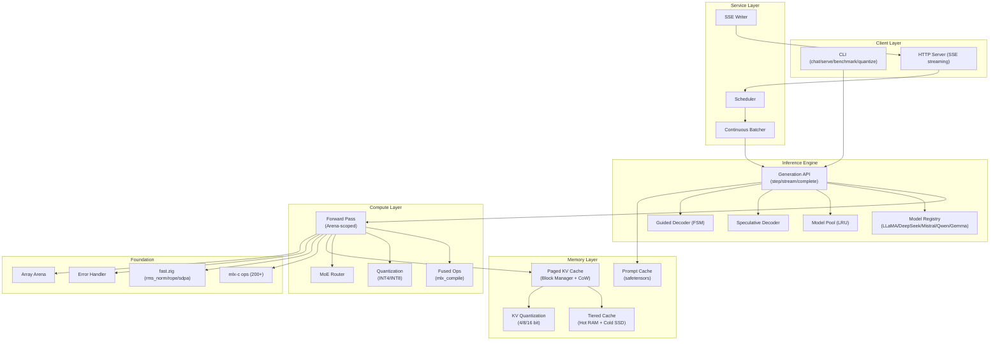
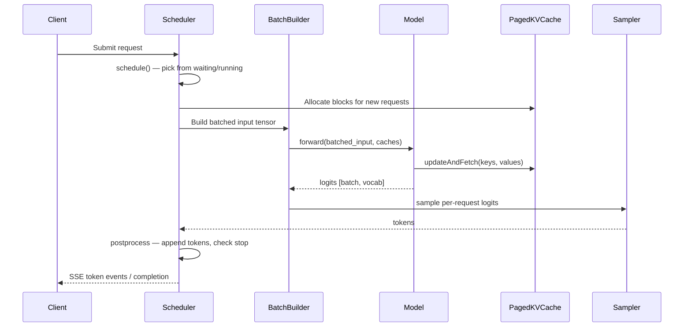

# Design Document: Production Deployment

## Overview

This design transforms mlx-zig from a prototype LLM inference engine into a production-grade system on Apple Silicon. The architecture follows a layered approach inspired by vLLM (scheduling, paged attention), mlx-lm (generation API, model registry), oMLX (multi-model management, tiered caching), and TileKernels (operator fusion, numerical verification).

The system is built on six architectural layers:

1. **Foundation Layer** — Error handling, memory safety, GPU-accelerated NN ops, portable build
2. **Inference Engine** — Three-layer generation API, model registry, prompt cache, operator fusion
3. **Service Layer** — Request scheduler, paged attention, KV quantization, SSE streaming, continuous batching
4. **Advanced Inference** — Chunked prefill, prefix caching, speculative decoding, guided decoding
5. **Quantization & Training** — Weight quantization, QLoRA, MoE routing
6. **Production Operations** — Model pool, tiered KV cache, memory limits, auto-configuration, benchmarking

All layers build on the existing mlx-c bindings (`src/c.zig`) and the MLX fused kernel bindings (`src/ops/fast.zig`). The key design principle is: **all computation flows through the MLX computation graph** — no CPU scalar loops for tensor operations.

## Architecture

### System Architecture Diagram



### Request Flow (Engine Step)



### Key Design Decisions

1. **VTable-based polymorphism** for models and KV cache strategies — already established in the codebase (`kvcache/interface.zig`), extended to models via `ModelVTable`
2. **Arena-scoped memory** for forward passes — `ScopedArrayArena` (`array_arena.zig`) already exists, needs consistent adoption
3. **mlx-c operator graph** for all computation — eliminates CPU scalar loops, enables GPU acceleration and `mlx_compile` fusion
4. **Block-based KV cache** as the default — `kvcache/paged.zig` skeleton exists, needs CoW and block manager completion
5. **Safetensors for all persistence** — prompt cache, tiered KV offload, weight I/O all use the existing `io/mlx_io.zig` safetensors support

## Components and Interfaces

### 1. Foundation Components

#### 1.1 Error Handler (`src/c.zig`)

Already implemented. The `mlxErrorHandler` export captures C++ exception text, and `check()` logs rc + message. No changes needed — R1 is satisfied by existing code.

#### 1.2 ScopedArrayArena (`src/array_arena.zig`)

Already implemented. Needs consistent adoption across all forward pass call sites.

**Integration pattern for model forward passes:**
```zig
pub fn forward(self: *Model, input: Array, caches: []KVCacheStrategy) !Array {
    var arena = ScopedArrayArena.init(self.allocator);
    defer arena.deinit();
    
    const hidden = try arena.track(try self.embed.forward(input));
    for (self.layers) |*layer| {
        hidden = try arena.track(try layer.forward(hidden, ...));
    }
    // Final output is NOT tracked — caller owns it
    return self.lm_head.forward(hidden);
}
```

#### 1.3 NN Layer GPU Acceleration

**Files to modify:** `src/ops/nn.zig`, `src/ops/loss.zig`

Current NN layers (Embedding, LSTM, GRU, RNN) use CPU scalar loops via `dataSliceMut`. These must be rewritten to use mlx-c operator chains:

| Layer | Current | Target |
|-------|---------|--------|
| `Embedding.forward` | CPU loop + `dataSliceMut` | `mlx_take(weight, indices, 0)` |
| `LSTM.forward` | CPU matmul + sigmoid loops | `ops.matmul` + `ops.sigmoid` chains |
| `GRU.forward` | CPU matmul + tanh loops | `ops.matmul` + `ops.tanh` chains |
| `RMSNorm.forward` | Already delegates to `fast.rmsNorm` | No change |
| `RoPE.apply` | Already delegates to `fast.rope` | No change |
| Loss functions | Mixed CPU/GPU | `crossEntropyGraph` pattern for all |

#### 1.4 Build System (`build.zig`)

**Current:** Falls back to hardcoded `/opt/homebrew` when no `-Dmlx_prefix` or `MLX_C_PREFIX` env var is set.

**Target:** Use `pkg-config` as primary discovery, `-Dmlx_prefix` as override, remove hardcoded fallback. Pin `zig-regex` to a fixed commit.

### 2. Inference Engine Components

<!-- sub-doc: design-inference-engine.md -->
See [Inference Engine Design](design-inference-engine.md) for generation API,
model registry, prompt cache, and operator fusion details.

### 3. Service Layer Components
<!-- sub-doc: design-server.md -->
See [Server Design](design-server.md) for HTTP server lifecycle, request routing,
SSE streaming protocol, generation pipeline, and scheduler integration.

### 4. Advanced Inference Components

#### 4.1 Speculative Decoder (`src/speculative.zig` — new file)

N-gram draft proposal — searches existing context for matching suffixes:

```zig
pub const NgramDrafter = struct {
    n: usize,  // n-gram size (default 3)
    
    pub fn propose(self: *NgramDrafter, context: []const u32, k: usize) ?[]const u32 {
        // Search context for last n tokens, return k continuation tokens
    }
};

pub fn verifyDraft(
    model: ModelVTable,
    context: []const u32,
    draft_tokens: []const u32,
    caches: []KVCacheStrategy,
    ctx: EagerContext,
) !struct { accepted: usize, tokens: []u32 } {
    // Single forward pass verifying all draft tokens
    // Accept/reject based on target model probabilities
}
```

#### 4.2 Guided Decoder (`src/guided.zig` — new file)

FSM-based logits masking for JSON schema and regex constraints:

```zig
pub const GuidedDecoder = struct {
    fsm: FiniteStateMachine,
    current_state: usize,
    
    pub fn maskLogits(self: *GuidedDecoder, logits: Array, ctx: EagerContext) !Array {
        const allowed = self.fsm.allowedTokens(self.current_state);
        // Set disallowed token logits to -inf
        return applyTokenMask(logits, allowed, ctx);
    }
    
    pub fn advance(self: *GuidedDecoder, token: u32) void {
        self.current_state = self.fsm.transition(self.current_state, token);
    }
};

pub const FiniteStateMachine = struct {
    states: []State,
    
    pub fn fromJsonSchema(allocator: std.mem.Allocator, schema: []const u8) !FiniteStateMachine { ... }
    pub fn fromRegex(allocator: std.mem.Allocator, pattern: []const u8) !FiniteStateMachine { ... }
};
```

### 5. Quantization & Training Components

#### 5.1 Weight Quantization (`src/quantize.zig` — new file)

```zig
pub const QuantConfig = struct {
    bits: u8 = 4,        // 4 or 8
    group_size: i32 = 64,
};

pub fn quantize(ctx: EagerContext, weight: Array, config: QuantConfig) !QuantizedWeight {
    // Uses mlx_quantize from mlx-c
}

pub fn dequantize(ctx: EagerContext, qw: QuantizedWeight) !Array {
    // Uses mlx_dequantize from mlx-c
}

pub const QuantizedWeight = struct {
    data: Array,
    scales: Array,
    biases: Array,
    config: QuantConfig,
};
```

#### 5.2 QLoRA (`src/qlora.zig` — new file)

Extends existing `src/lora.zig` with quantized base weights:

```zig
pub const QLoRALayer = struct {
    base_quantized: QuantizedWeight,  // 4-bit NF4 quantized base
    lora_a: Array,                     // trainable
    lora_b: Array,                     // trainable
    scaling: f32,
    
    pub fn forward(self: *QLoRALayer, x: Array, ctx: EagerContext) !Array {
        // dequantize(W_base) * x + (B @ A) * x * scaling
        const base_out = try dequantizedMatmul(ctx, x, self.base_quantized);
        const lora_out = try loraForward(ctx, x, self.lora_a, self.lora_b, self.scaling);
        return ops.add(ctx, base_out, lora_out);
    }
};
```

#### 5.3 MoE Router (enhancement to `src/models/deepseek_v4.zig`)

The existing `DSV4Gate` and `DSV4MoE` implement MoE routing. The enhancement extracts a reusable `MoERouter` module:

```zig
pub const MoERouter = struct {
    pub fn topkRoute(ctx: EagerContext, scores: Array, k: usize) !RouteResult { ... }
    pub fn expandTokens(ctx: EagerContext, x: Array, route: RouteResult) !Array { ... }
    pub fn reduceExperts(ctx: EagerContext, expert_outs: Array, weights: Array, route: RouteResult) !Array { ... }
};
```

### 6. Production Operations Components

### 7. Model Architecture: DeepSeek V4

<!-- sub-doc: design-deepseek-v4.md -->
See [DeepSeek V4 Design](design-deepseek-v4.md) for the complete architecture
covering weight loading, dual-path attention, cache, and model-level fixes.
This design was extracted from Phase 8 implementation tasks and cross-referenced
with `mlx-lm/mlx_lm/models/deepseek_v4.py`.

#### 6.1 Model Pool (`src/model_pool.zig` — new file)

```zig
pub const ModelPool = struct {
    allocator: std.mem.Allocator,
    models: std.StringHashMap(LoadedModel),
    lru_order: std.ArrayList([]const u8),
    max_memory: usize,
    pinned: std.StringHashMap(void),
    
    pub fn getOrLoad(self: *ModelPool, name: []const u8, path: []const u8) !*LoadedModel { ... }
    pub fn evictLRU(self: *ModelPool) !void { ... }
    pub fn pin(self: *ModelPool, name: []const u8) void { ... }
};
```

#### 6.2 Tiered KV Cache (`src/kvcache/tiered.zig` — new file)

```zig
pub const TieredKVCache = struct {
    hot: PagedKVCache,           // RAM tier
    cold_dir: []const u8,        // SSD directory for safetensors
    hot_capacity: usize,         // max blocks in hot tier
    access_recency: std.AutoHashMap(usize, u64),  // block_id -> last_access_time
    
    pub fn evictToSSD(self: *TieredKVCache, block_id: usize) !void { ... }
    pub fn restoreFromSSD(self: *TieredKVCache, block_id: usize) !void { ... }
};
```

#### 6.3 Memory Limiter (`src/memory.zig` — new file)

```zig
pub const MemoryConfig = struct {
    max_bytes: ?usize = null,       // absolute limit
    max_percent: ?f32 = null,       // percentage of system RAM
    safety_margin_bytes: usize = 512 * 1024 * 1024,  // 512MB default
};

pub fn enforceMemoryLimit(pool: *ModelPool, tiered_cache: *TieredKVCache, config: MemoryConfig) !void { ... }

pub fn autoMaxKvSize(model_bytes: usize, num_layers: usize, num_kv_heads: usize, head_dim: usize, kv_bits: u8) usize {
    const total_ram = getSystemMemoryBytes();
    const available = total_ram - model_bytes - safety_margin;
    const bytes_per_token = 2 * num_kv_heads * head_dim * (kv_bits / 8) * num_layers;
    return available / bytes_per_token;
}
```

#### 6.4 Benchmark Tool (`src/benchmark.zig` — new file)

```zig
pub const BenchmarkConfig = struct {
    model_path: []const u8,
    input_tokens: usize = 32,
    output_tokens: usize = 128,
    warmup_runs: usize = 1,
    num_runs: usize = 3,
};

pub const BenchmarkResult = struct {
    ttft_ms: f64,           // time to first token
    itl_ms: f64,            // inter-token latency (mean)
    throughput_tps: f64,    // tokens per second
    peak_memory_mb: f64,    // peak memory usage
};
```

## Data Models

### Core Data Structures

```zig
// KV Cache Block (enhanced from paged.zig)
const Block = struct {
    keys: Array,           // [1, num_kv_heads, block_size, head_dim]
    values: Array,         // [1, num_kv_heads, block_size, head_dim]
    used: bool,
    ref_count: usize,      // for Copy-on-Write
    hash: ?u64,            // for prefix caching
    last_access: u64,      // for LRU eviction (tiered cache)
    tokens_used: usize,    // how many of block_size slots are filled
};

// Request (scheduler)
const Request = struct {
    id: u64,
    prompt_tokens: []const u32,
    generated_tokens: std.ArrayList(u32),
    state: RequestState,
    block_ids: std.ArrayList(usize),
    config: GenerateConfig,
    prefill_offset: usize,       // for chunked prefill
    created_at: u64,
};

const RequestState = enum { waiting, prefilling, decoding, done };

// Model Instance (registry)
const ModelInstance = struct {
    vtable: ModelVTable,
    ptr: *anyopaque,
    config: ModelConfig,
    memory_bytes: usize,
    last_used: u64,          // for LRU in model pool
    pinned: bool,
};

// Quantized Weight
const QuantizedWeight = struct {
    data: Array,             // quantized data
    scales: Array,           // per-group scales
    biases: Array,           // per-group biases
    config: QuantConfig,
    original_shape: []const i32,
};

// FSM State (guided decoding)
const FSMState = struct {
    transitions: std.AutoHashMap(u32, usize),  // token -> next_state
    is_accepting: bool,
    allowed_tokens: []const u32,               // precomputed for masking
};
```

### Persistence Formats

All persistence uses safetensors via `src/io/mlx_io.zig`:

| Data | Format | Metadata Keys |
|------|--------|---------------|
| Prompt cache | safetensors | `num_layers`, `head_dim`, `num_kv_heads`, `seq_len`, `dtype` |
| Tiered KV blocks | safetensors | `block_id`, `block_hash`, `tokens_used` |
| Quantized weights | safetensors | `bits`, `group_size`, `original_dtype`, `original_shape` |
| Golden test refs | safetensors | `layer_name`, `input_shape`, `dtype` |


## Correctness Properties

<!-- sub-doc: design-correctness-properties.md -->
See [Correctness Properties](design-correctness-properties.md) for the full
list of 21 properties that validate requirements across all components.

## Error Handling

### Error Categories

| Category | Source | Handling Strategy |
|----------|--------|-------------------|
| MLX C++ exceptions | `c.check()` | Log rc + error message, return `error.MlxError` |
| Block pool exhaustion | `BlockManager.allocateBlocks` | Keep request in waiting queue, retry next step |
| Memory limit exceeded | `MemoryLimiter` | Trigger LRU eviction; if still over, reject request |
| Model not found | `ModelRegistry.lookup` | Return descriptive error with architecture name |
| Prompt cache incompatible | `loadPromptCache` | Return error, caller falls back to full prefill |
| Page pool exhausted | `PagedKVCache.allocPage` | Return `error.PagePoolExhausted`, scheduler retries |
| Quantization invalid bits | `QuantConfig` validation | Return `error.InvalidQuantBits` at config time |
| FSM no valid transitions | `GuidedDecoder.maskLogits` | Force EOS token if no valid tokens remain |
| SSD I/O failure | `TieredKVCache` evict/restore | Log error, keep block in hot tier (evict) or return error (restore) |

### Error Propagation

All errors propagate via Zig's `!` error union mechanism. The server layer catches errors and returns appropriate HTTP status codes:

- `error.MlxError` → 500 Internal Server Error with MLX error message
- `error.PagePoolExhausted` → 503 Service Unavailable (retry later)
- `error.ModelNotFound` → 400 Bad Request with architecture name
- `error.MemoryLimitExceeded` → 503 Service Unavailable

### Graceful Degradation

1. **KV cache pressure**: Scheduler keeps requests waiting rather than OOM
2. **Model pool full**: LRU eviction before loading new model
3. **Tiered cache SSD failure**: Fall back to RAM-only with reduced capacity
4. **Prompt cache mismatch**: Fall back to full prefill (no crash)

## Testing Strategy

### Dual Testing Approach

This feature uses both unit tests and property-based tests for comprehensive coverage.

**Property-Based Testing Library**: [zig-quickcheck](https://github.com/zig-quickcheck) or custom generators using `std.Random` with minimum 100 iterations per property.

**Unit tests** cover:
- Specific examples (e.g., registry contains exactly 5 architectures)
- Integration points (SSE streaming format, HTTP response codes)
- Edge cases (empty prompt, zero max_tokens, kv_bits validation)
- Smoke tests (build system configuration, CLI parameter acceptance)

**Property tests** cover:
- All 21 correctness properties defined above
- Each property test runs minimum 100 iterations with random inputs
- Each test is tagged: `Feature: production-deployment, Property {N}: {title}`

### Test Organization

```
src/tests/
├── golden/                    # Pre-computed Python MLX reference data
│   ├── rms_norm_ref.safetensors
│   ├── rope_ref.safetensors
│   ├── sdpa_ref.safetensors
│   ├── embedding_ref.safetensors
│   └── tinyllama_e2e_ref.safetensors
├── golden_test.zig            # Property 1: NN layer numerical equivalence
├── arena_tests.zig            # Property 2: Forward pass arena cleanup
├── generation_tests.zig       # Property 3: Generation API consistency
├── registry_tests.zig         # Property 4: Model registry lookup
├── prompt_cache_tests.zig     # Property 5: Prompt cache round-trip
├── fusion_tests.zig           # Property 6: Fused op equivalence
├── scheduler_tests.zig        # Properties 7, 8, 12: Scheduler invariants
├── block_manager_tests.zig    # Properties 8, 9, 13: Block management
├── quantization_tests.zig     # Property 10: Quantize-dequantize round-trip
├── batching_tests.zig         # Property 11: Continuous batching isolation
├── speculative_tests.zig      # Properties 14, 15: Speculative decoding
├── guided_tests.zig           # Property 16: Guided decoding
├── qlora_tests.zig            # Property 17: QLoRA correctness
├── moe_tests.zig              # Property 18: MoE routing
├── model_pool_tests.zig       # Property 19: Model pool LRU
├── tiered_cache_tests.zig     # Property 20: Tiered cache round-trip
├── auto_config_tests.zig      # Property 21: Auto max_kv_size
└── e2e_tests.zig              # End-to-end inference comparison
```

### Property Test Configuration

- Minimum 100 iterations per property test
- Each property test references its design document property number
- Tag format: `Feature: production-deployment, Property {N}: {title}`
- Random seed is logged for reproducibility on failure
- Cosine similarity threshold: 0.9999 for float32, 0.99 for 8-bit quantized, 0.95 for 4-bit quantized

### Golden Test Generation

A Python script (`tests/generate_golden.py`) generates reference data:
1. For each NN layer, create random inputs and compute outputs using Python MLX
2. Save input/output pairs as safetensors files in `tests/golden/`
3. Zig tests load these files and compare against mlx-zig output
4. End-to-end test uses TinyLlama-1.1B with a fixed prompt and seed

## Module-Document Mapping

Quick reference for finding the design document for each source file.

| Source File | Design Document | Layer |
|-------------|-----------------|-------|
| `src/generation.zig` | [Inference Engine](design-inference-engine.md) | L1/L2 |
| `src/model_registry.zig` | [Inference Engine](design-inference-engine.md) | L1/L2 |
| `src/server.zig` | [Server](design-server.md) | L1/L2 |
| `src/batch_builder.zig` | [Batch Builder](design-batch-builder.md) | L1/L2 |
| `src/scheduler.zig` | [Server](design-server.md) § Engine Loop | L1 (placeholder) |
| `src/kvcache/paged.zig` | [Paged KV Cache](design-paged-kv-cache.md) | L1/L2 |
| `src/kvcache/quantized.zig` | [Paged KV Cache](design-paged-kv-cache.md) | L1/L2 |
| `src/kvcache/tiered.zig` | `design.md` § 4.4 Tiered Cache | L1 |
| `src/speculative.zig` | [Inference Engine](design-inference-engine.md) § Speculative Decoding | L1/L2 |
| `src/memory.zig` | `design.md` § 4.3 Memory Management | L1 |
| `src/array_arena.zig` | `design.md` § 1.2 ScopedArrayArena | L1 |
| `src/models/deepseek_v4.zig` | [DeepSeek V4](design-deepseek-v4.md) | L1/L2 |

**Sub-documents:**
- [`design-inference-engine.md`](design-inference-engine.md) — Generation API, Model Registry, Prompt Cache
- [`design-correctness-properties.md`](design-correctness-properties.md) — 21 correctness properties
- [`design-deepseek-v4.md`](design-deepseek-v4.md) — DeepSeek V4 architecture specifics
- [`design-server.md`](design-server.md) — HTTP server, SSE streaming, scheduler integration
- [`design-batch-builder.md`](design-batch-builder.md) — Continuous batching tensor construction
- [`design-paged-kv-cache.md`](design-paged-kv-cache.md) — Block/page-based KV cache
