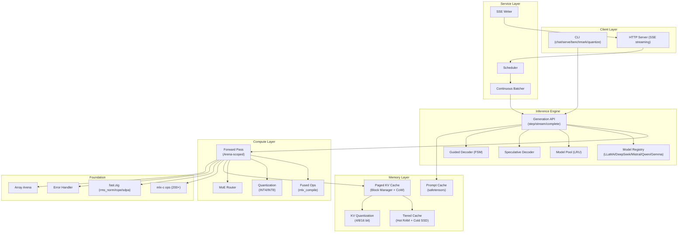
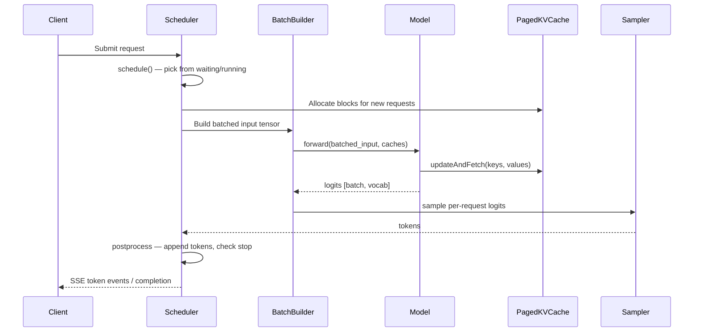

# Design Document: Production Deployment

## Overview

This design transforms mlx-zig from a prototype LLM inference engine into a production-grade system on Apple Silicon. The architecture follows a layered approach inspired by vLLM (scheduling, paged attention), mlx-lm (generation API, model registry), oMLX (multi-model management, tiered caching), and TileKernels (operator fusion, numerical verification).

The system is built on six architectural layers:

1. **Foundation Layer** — Error handling, memory safety, GPU-accelerated NN ops, portable build
2. **Inference Engine** — Three-layer generation API, model registry, prompt cache, operator fusion
3. **Service Layer** — Request scheduler, paged attention, KV quantization, SSE streaming, continuous batching
4. **Advanced Inference** — Chunked prefill, prefix caching, speculative decoding, guided decoding
5. **Quantization & Training** — Weight quantization, QLoRA, MoE routing
6. **Production Operations** — Model pool, tiered KV cache, memory limits, auto-configuration, benchmarking

All layers build on the existing mlx-c bindings (`src/c.zig`) and the MLX fused kernel bindings (`src/ops/fast.zig`). The key design principle is: **all computation flows through the MLX computation graph** — no CPU scalar loops for tensor operations.

## Architecture

### System Architecture Diagram



### Request Flow (Engine Step)



### Key Design Decisions

1. **VTable-based polymorphism** for models and KV cache strategies — already established in the codebase (`kvcache/interface.zig`), extended to models via `ModelVTable`
2. **Arena-scoped memory** for forward passes — `ScopedArrayArena` (`array_arena.zig`) already exists, needs consistent adoption
3. **mlx-c operator graph** for all computation — eliminates CPU scalar loops, enables GPU acceleration and `mlx_compile` fusion
4. **Block-based KV cache** as the default — `kvcache/paged.zig` skeleton exists, needs CoW and block manager completion
5. **Safetensors for all persistence** — prompt cache, tiered KV offload, weight I/O all use the existing `io/mlx_io.zig` safetensors support

## Components and Interfaces

### 1. Foundation Components

#### 1.1 Error Handler (`src/c.zig`)

Already implemented. The `mlxErrorHandler` export captures C++ exception text, and `check()` logs rc + message. No changes needed — R1 is satisfied by existing code.

#### 1.2 ScopedArrayArena (`src/array_arena.zig`)

Already implemented. Needs consistent adoption across all forward pass call sites.

**Integration pattern for model forward passes:**
```zig
pub fn forward(self: *Model, input: Array, caches: []KVCacheStrategy) !Array {
    var arena = ScopedArrayArena.init(self.allocator);
    defer arena.deinit();
    
    const hidden = try arena.track(try self.embed.forward(input));
    for (self.layers) |*layer| {
        hidden = try arena.track(try layer.forward(hidden, ...));
    }
    // Final output is NOT tracked — caller owns it
    return self.lm_head.forward(hidden);
}
```

#### 1.3 NN Layer GPU Acceleration

**Files to modify:** `src/ops/nn.zig`, `src/ops/loss.zig`

Current NN layers (Embedding, LSTM, GRU, RNN) use CPU scalar loops via `dataSliceMut`. These must be rewritten to use mlx-c operator chains:

| Layer | Current | Target |
|-------|---------|--------|
| `Embedding.forward` | CPU loop + `dataSliceMut` | `mlx_take(weight, indices, 0)` |
| `LSTM.forward` | CPU matmul + sigmoid loops | `ops.matmul` + `ops.sigmoid` chains |
| `GRU.forward` | CPU matmul + tanh loops | `ops.matmul` + `ops.tanh` chains |
| `RMSNorm.forward` | Already delegates to `fast.rmsNorm` | No change |
| `RoPE.apply` | Already delegates to `fast.rope` | No change |
| Loss functions | Mixed CPU/GPU | `crossEntropyGraph` pattern for all |

#### 1.4 Build System (`build.zig`)

**Current:** Falls back to hardcoded `/opt/homebrew` when no `-Dmlx_prefix` or `MLX_C_PREFIX` env var is set.

**Target:** Use `pkg-config` as primary discovery, `-Dmlx_prefix` as override, remove hardcoded fallback. Pin `zig-regex` to a fixed commit.

### 2. Inference Engine Components

#### 2.1 Three-Layer Generation API (`src/generation.zig` — new file)

```zig
pub const GenerateConfig = struct {
    max_tokens: usize = 256,
    temperature: f32 = 0.8,
    top_k: usize = 50,
    top_p: f32 = 1.0,
    stop_tokens: []const u32 = &.{},
    seed: u64 = 0,
};

/// Layer 1: Single-step generation primitive
pub fn generateStep(
    model: ModelVTable,
    tokens: Array,
    caches: []KVCacheStrategy,
    sampler: *SamplerConfig,
    ctx: EagerContext,
) !u32 { ... }

/// Layer 2: Streaming generation with per-token callback
pub fn streamGenerate(
    model: ModelVTable,
    prompt_tokens: []const u32,
    config: GenerateConfig,
    caches: []KVCacheStrategy,
    ctx: EagerContext,
    callback: *const fn (token: u32, is_done: bool) void,
) !void { ... }

/// Layer 3: Complete generation returning full sequence
pub fn generate(
    model: ModelVTable,
    prompt_tokens: []const u32,
    config: GenerateConfig,
    caches: []KVCacheStrategy,
    ctx: EagerContext,
) ![]u32 { ... }
```

`streamGenerate` and `generate` are implemented in terms of `generateStep`.

#### 2.2 Model Registry (`src/model_registry.zig` — new file)

```zig
pub const ModelVTable = struct {
    forward: *const fn (ctx: *anyopaque, input: Array, mask: ?Array, caches: ?[]KVCacheStrategy) anyerror!Array,
    deinit: *const fn (ctx: *anyopaque, allocator: std.mem.Allocator) void,
    config: ModelConfig,
};

pub const ModelConfig = struct {
    num_layers: usize,
    num_kv_heads: usize,
    head_dim: usize,
    vocab_size: usize,
    hidden_size: usize,
};

/// Compile-time registry mapping architecture names to loader functions
pub const model_registry = std.StaticStringMap(ModelLoader).initComptime(.{
    .{ "LlamaForCausalLM", llama_loader },
    .{ "DeepseekV4ForCausalLM", deepseek_v4_loader },
    .{ "MistralForCausalLM", llama_loader },  // Mistral uses LLaMA arch
    .{ "Qwen2ForCausalLM", llama_loader },     // Qwen2 uses LLaMA arch with q/k norms
    .{ "GemmaForCausalLM", gemma_loader },
});

pub const ModelLoader = *const fn (
    allocator: std.mem.Allocator,
    model_path: []const u8,
    ctx: EagerContext,
    stream: c.c.mlx_stream,
) anyerror!ModelInstance;
```

#### 2.3 Prompt Cache (`src/prompt_cache.zig` — new file)

Serializes/deserializes KV cache state using the existing safetensors I/O:

```zig
pub fn savePromptCache(
    allocator: std.mem.Allocator,
    caches: []KVCacheStrategy,
    path: []const u8,
) !void {
    // For each layer, extract keys/values arrays
    // Store as safetensors with metadata: {num_layers, head_dim, num_kv_heads, seq_len}
}

pub fn loadPromptCache(
    allocator: std.mem.Allocator,
    path: []const u8,
    model_config: ModelConfig,
) ![]KVCacheStrategy {
    // Load safetensors, validate metadata against model_config
    // Reconstruct KV cache strategies with loaded data
}
```

#### 2.4 Operator Fusion (`src/ops/fused.zig` — new file)

Uses `src/compile.zig` (already bound to `mlx_compile`) to fuse composite operations:

```zig
/// Compiled SwiGLU MLP: gate_proj + silu + up_proj + down_proj as single fused op
pub fn compiledSwiGLU(ctx: EagerContext) !Closure { ... }

/// Compiled AdamW step: ~15 intermediate arrays fused into one kernel launch
pub fn compiledAdamWStep(ctx: EagerContext) !Closure { ... }
```

### 3. Service Layer Components

#### 3.1 Request Scheduler (`src/scheduler.zig` — new file)

```zig
pub const Request = struct {
    id: u64,
    prompt_tokens: []const u32,
    generated_tokens: std.ArrayList(u32),
    state: enum { waiting, prefilling, decoding, done },
    block_ids: std.ArrayList(usize),  // owned KV cache blocks
    max_tokens: usize,
    stop_tokens: []const u32,
    // Chunked prefill state
    prefill_offset: usize,
};

pub const Scheduler = struct {
    allocator: std.mem.Allocator,
    waiting: std.ArrayList(*Request),
    running: std.ArrayList(*Request),
    block_manager: *BlockManager,
    max_prefill_tokens: usize,

    pub fn schedule(self: *Scheduler) !ScheduleResult { ... }
    pub fn postprocess(self: *Scheduler, outputs: []const TokenOutput) !void { ... }
};

pub const ScheduleResult = struct {
    prefill_requests: []const *Request,
    decode_requests: []const *Request,
    batched_tokens: Array,
    position_ids: Array,
    attention_mask: Array,
};
```

#### 3.2 Block Manager (enhancement to `src/kvcache/paged.zig`)

```zig
pub const BlockManager = struct {
    allocator: std.mem.Allocator,
    free_blocks: std.ArrayList(usize),
    block_pool: std.ArrayList(Block),
    req_to_blocks: std.AutoHashMap(u64, std.ArrayList(usize)),
    block_hashes: std.AutoHashMap(u64, usize),  // for prefix caching
    total_blocks: usize,

    pub fn allocateBlocks(self: *BlockManager, req_id: u64, num_blocks: usize) ![]usize { ... }
    pub fn freeBlocks(self: *BlockManager, req_id: u64) void { ... }
    pub fn copyOnWrite(self: *BlockManager, block_id: usize) !usize { ... }
    pub fn canAllocate(self: *BlockManager, num_blocks: usize) bool { ... }
    
    // Prefix caching
    pub fn hashBlock(prev_hash: u64, token_ids: []const u32) u64 { ... }
    pub fn findCachedPrefix(self: *BlockManager, token_ids: []const u32, block_size: usize) ![]usize { ... }
};
```

#### 3.3 SSE Streaming (enhancement to `src/server.zig`)

```zig
pub fn writeSSEEvent(writer: anytype, data: []const u8) !void {
    try writer.writeAll("data: ");
    try writer.writeAll(data);
    try writer.writeAll("\n\n");
}

pub fn writeSSEKeepAlive(writer: anytype) !void {
    try writer.writeAll(": keep-alive\n\n");
}
```

The server's `handleRequest` function branches on `stream: true` to use SSE instead of buffered JSON response.

### 4. Advanced Inference Components

#### 4.1 Speculative Decoder (`src/speculative.zig` — new file)

N-gram draft proposal — searches existing context for matching suffixes:

```zig
pub const NgramDrafter = struct {
    n: usize,  // n-gram size (default 3)
    
    pub fn propose(self: *NgramDrafter, context: []const u32, k: usize) ?[]const u32 {
        // Search context for last n tokens, return k continuation tokens
    }
};

pub fn verifyDraft(
    model: ModelVTable,
    context: []const u32,
    draft_tokens: []const u32,
    caches: []KVCacheStrategy,
    ctx: EagerContext,
) !struct { accepted: usize, tokens: []u32 } {
    // Single forward pass verifying all draft tokens
    // Accept/reject based on target model probabilities
}
```

#### 4.2 Guided Decoder (`src/guided.zig` — new file)

FSM-based logits masking for JSON schema and regex constraints:

```zig
pub const GuidedDecoder = struct {
    fsm: FiniteStateMachine,
    current_state: usize,
    
    pub fn maskLogits(self: *GuidedDecoder, logits: Array, ctx: EagerContext) !Array {
        const allowed = self.fsm.allowedTokens(self.current_state);
        // Set disallowed token logits to -inf
        return applyTokenMask(logits, allowed, ctx);
    }
    
    pub fn advance(self: *GuidedDecoder, token: u32) void {
        self.current_state = self.fsm.transition(self.current_state, token);
    }
};

pub const FiniteStateMachine = struct {
    states: []State,
    
    pub fn fromJsonSchema(allocator: std.mem.Allocator, schema: []const u8) !FiniteStateMachine { ... }
    pub fn fromRegex(allocator: std.mem.Allocator, pattern: []const u8) !FiniteStateMachine { ... }
};
```

### 5. Quantization & Training Components

#### 5.1 Weight Quantization (`src/quantize.zig` — new file)

```zig
pub const QuantConfig = struct {
    bits: u8 = 4,        // 4 or 8
    group_size: i32 = 64,
};

pub fn quantize(ctx: EagerContext, weight: Array, config: QuantConfig) !QuantizedWeight {
    // Uses mlx_quantize from mlx-c
}

pub fn dequantize(ctx: EagerContext, qw: QuantizedWeight) !Array {
    // Uses mlx_dequantize from mlx-c
}

pub const QuantizedWeight = struct {
    data: Array,
    scales: Array,
    biases: Array,
    config: QuantConfig,
};
```

#### 5.2 QLoRA (`src/qlora.zig` — new file)

Extends existing `src/lora.zig` with quantized base weights:

```zig
pub const QLoRALayer = struct {
    base_quantized: QuantizedWeight,  // 4-bit NF4 quantized base
    lora_a: Array,                     // trainable
    lora_b: Array,                     // trainable
    scaling: f32,
    
    pub fn forward(self: *QLoRALayer, x: Array, ctx: EagerContext) !Array {
        // dequantize(W_base) * x + (B @ A) * x * scaling
        const base_out = try dequantizedMatmul(ctx, x, self.base_quantized);
        const lora_out = try loraForward(ctx, x, self.lora_a, self.lora_b, self.scaling);
        return ops.add(ctx, base_out, lora_out);
    }
};
```

#### 5.3 MoE Router (enhancement to `src/models/deepseek_v4.zig`)

The existing `DSV4Gate` and `DSV4MoE` implement MoE routing. The enhancement extracts a reusable `MoERouter` module:

```zig
pub const MoERouter = struct {
    pub fn topkRoute(ctx: EagerContext, scores: Array, k: usize) !RouteResult { ... }
    pub fn expandTokens(ctx: EagerContext, x: Array, route: RouteResult) !Array { ... }
    pub fn reduceExperts(ctx: EagerContext, expert_outs: Array, weights: Array, route: RouteResult) !Array { ... }
};
```

### 6. Production Operations Components

#### 6.1 Model Pool (`src/model_pool.zig` — new file)

```zig
pub const ModelPool = struct {
    allocator: std.mem.Allocator,
    models: std.StringHashMap(LoadedModel),
    lru_order: std.ArrayList([]const u8),
    max_memory: usize,
    pinned: std.StringHashMap(void),
    
    pub fn getOrLoad(self: *ModelPool, name: []const u8, path: []const u8) !*LoadedModel { ... }
    pub fn evictLRU(self: *ModelPool) !void { ... }
    pub fn pin(self: *ModelPool, name: []const u8) void { ... }
};
```

#### 6.2 Tiered KV Cache (`src/kvcache/tiered.zig` — new file)

```zig
pub const TieredKVCache = struct {
    hot: PagedKVCache,           // RAM tier
    cold_dir: []const u8,        // SSD directory for safetensors
    hot_capacity: usize,         // max blocks in hot tier
    access_recency: std.AutoHashMap(usize, u64),  // block_id -> last_access_time
    
    pub fn evictToSSD(self: *TieredKVCache, block_id: usize) !void { ... }
    pub fn restoreFromSSD(self: *TieredKVCache, block_id: usize) !void { ... }
};
```

#### 6.3 Memory Limiter (`src/memory.zig` — new file)

```zig
pub const MemoryConfig = struct {
    max_bytes: ?usize = null,       // absolute limit
    max_percent: ?f32 = null,       // percentage of system RAM
    safety_margin_bytes: usize = 512 * 1024 * 1024,  // 512MB default
};

pub fn enforceMemoryLimit(pool: *ModelPool, tiered_cache: *TieredKVCache, config: MemoryConfig) !void { ... }

pub fn autoMaxKvSize(model_bytes: usize, num_layers: usize, num_kv_heads: usize, head_dim: usize, kv_bits: u8) usize {
    const total_ram = getSystemMemoryBytes();
    const available = total_ram - model_bytes - safety_margin;
    const bytes_per_token = 2 * num_kv_heads * head_dim * (kv_bits / 8) * num_layers;
    return available / bytes_per_token;
}
```

#### 6.4 Benchmark Tool (`src/benchmark.zig` — new file)

```zig
pub const BenchmarkConfig = struct {
    model_path: []const u8,
    input_tokens: usize = 32,
    output_tokens: usize = 128,
    warmup_runs: usize = 1,
    num_runs: usize = 3,
};

pub const BenchmarkResult = struct {
    ttft_ms: f64,           // time to first token
    itl_ms: f64,            // inter-token latency (mean)
    throughput_tps: f64,    // tokens per second
    peak_memory_mb: f64,    // peak memory usage
};
```

## Data Models

### Core Data Structures

```zig
// KV Cache Block (enhanced from paged.zig)
const Block = struct {
    keys: Array,           // [1, num_kv_heads, block_size, head_dim]
    values: Array,         // [1, num_kv_heads, block_size, head_dim]
    used: bool,
    ref_count: usize,      // for Copy-on-Write
    hash: ?u64,            // for prefix caching
    last_access: u64,      // for LRU eviction (tiered cache)
    tokens_used: usize,    // how many of block_size slots are filled
};

// Request (scheduler)
const Request = struct {
    id: u64,
    prompt_tokens: []const u32,
    generated_tokens: std.ArrayList(u32),
    state: RequestState,
    block_ids: std.ArrayList(usize),
    config: GenerateConfig,
    prefill_offset: usize,       // for chunked prefill
    created_at: u64,
};

const RequestState = enum { waiting, prefilling, decoding, done };

// Model Instance (registry)
const ModelInstance = struct {
    vtable: ModelVTable,
    ptr: *anyopaque,
    config: ModelConfig,
    memory_bytes: usize,
    last_used: u64,          // for LRU in model pool
    pinned: bool,
};

// Quantized Weight
const QuantizedWeight = struct {
    data: Array,             // quantized data
    scales: Array,           // per-group scales
    biases: Array,           // per-group biases
    config: QuantConfig,
    original_shape: []const i32,
};

// FSM State (guided decoding)
const FSMState = struct {
    transitions: std.AutoHashMap(u32, usize),  // token -> next_state
    is_accepting: bool,
    allowed_tokens: []const u32,               // precomputed for masking
};
```

### Persistence Formats

All persistence uses safetensors via `src/io/mlx_io.zig`:

| Data | Format | Metadata Keys |
|------|--------|---------------|
| Prompt cache | safetensors | `num_layers`, `head_dim`, `num_kv_heads`, `seq_len`, `dtype` |
| Tiered KV blocks | safetensors | `block_id`, `block_hash`, `tokens_used` |
| Quantized weights | safetensors | `bits`, `group_size`, `original_dtype`, `original_shape` |
| Golden test refs | safetensors | `layer_name`, `input_shape`, `dtype` |


## Correctness Properties

*A property is a characteristic or behavior that should hold true across all valid executions of a system — essentially, a formal statement about what the system should do. Properties serve as the bridge between human-readable specifications and machine-verifiable correctness guarantees.*

### Property 1: NN Layer GPU Numerical Equivalence

*For any* NN layer (RMSNorm, RoPE, SDPA, Embedding, LSTM, GRU, loss functions) and *for any* valid input tensor, the GPU-accelerated implementation (via mlx-c operator chains or fast.zig fused kernels) SHALL produce output with cosine similarity ≥ 0.9999 compared to a pre-computed Python MLX reference output.

**Validates: Requirements 3.1, 3.2, 3.3, 3.4, 3.5, 3.6, 26.1, 26.2**

### Property 2: Forward Pass Arena Cleanup

*For any* model and *for any* valid input tensor, after a forward pass completes and the ScopedArrayArena is deinitialized, all intermediate Arrays tracked by the arena SHALL be released, and only the final output Array SHALL remain live.

**Validates: Requirements 2.1, 2.2**

### Property 3: Generation API Consistency

*For any* model, prompt, and generation config, the sequence of tokens produced by `streamGenerate` (collected via callback) SHALL be identical to the sequence returned by `generate`, and both SHALL have length ≤ `max_tokens`.

**Validates: Requirements 5.1, 5.2, 5.3, 5.4**

### Property 4: Model Registry Lookup Correctness

*For any* architecture name string, looking it up in the Model_Registry SHALL succeed if and only if the architecture is registered. When lookup fails, the error message SHALL contain the queried architecture name.

**Validates: Requirements 6.2, 6.4**

### Property 5: Prompt Cache Round-Trip

*For any* valid KV cache state, saving to a safetensors file and loading it back SHALL produce a KV cache state with keys and values that are element-wise equal to the original. Loading with a mismatched model configuration (different num_layers, head_dim, or num_kv_heads) SHALL return an error.

**Validates: Requirements 7.1, 7.2, 7.3, 7.4**

### Property 6: Fused Operation Numerical Equivalence

*For any* valid input tensors, a compiled fused operation (SwiGLU MLP, AdamW step) SHALL produce output with cosine similarity ≥ 0.9999 compared to the unfused implementation.

**Validates: Requirements 8.1, 8.2, 8.3**

### Property 7: Scheduler Prioritization Invariant

*For any* set of waiting and running requests, the Scheduler's `schedule()` output SHALL include all running (decode-phase) requests before any waiting (prefill-phase) requests. Running requests SHALL always be scheduled if they have allocated blocks.

**Validates: Requirements 9.2**

### Property 8: Block Conservation

*For any* sequence of block allocation and deallocation operations on the Block_Manager, the sum of free blocks and used blocks SHALL always equal the total block count. When a request completes and its blocks are freed, those blocks SHALL appear in the free pool.

**Validates: Requirements 9.3, 9.4, 9.5, 10.1, 10.2, 10.3, 10.5**

### Property 9: Copy-on-Write Isolation

*For any* Block shared by two or more requests (ref_count > 1), when one request modifies the block, the Block_Manager SHALL create a copy before mutation. The other request's view of the block SHALL remain unchanged.

**Validates: Requirements 10.4, 15.3**

### Property 10: Quantize-Dequantize Round-Trip

*For any* tensor (KV cache entry or model weight) and *for any* valid bit-width (4 or 8), quantizing with `mlx_quantize` and then dequantizing with `mlx_dequantize` SHALL produce a tensor with cosine similarity ≥ 0.99 to the original for 8-bit and ≥ 0.95 for 4-bit.

**Validates: Requirements 11.2, 11.3, 18.1, 18.2**

### Property 11: Continuous Batching Attention Isolation

*For any* batch of N request sequences concatenated into a single tensor, the attention mask SHALL ensure that each request's tokens attend only to tokens within the same request. The batched tensor length SHALL equal the sum of individual sequence lengths.

**Validates: Requirements 13.1, 13.2**

### Property 12: Chunked Prefill Correctness

*For any* prompt with length exceeding `max_prefill_tokens`, the Scheduler SHALL split it into ceil(prompt_len / max_prefill_tokens) chunks. While chunked prefill is in progress for one request, decode steps for other active requests SHALL continue to be scheduled.

**Validates: Requirements 14.2, 14.3**

### Property 13: Block Hash Determinism and Prefix Reuse

*For any* sequence of token IDs, `hashBlock(prev_hash, token_ids)` SHALL be deterministic — the same inputs always produce the same hash. When two requests share a token prefix that aligns to block boundaries, the second request SHALL reuse the first request's cached blocks for the shared prefix.

**Validates: Requirements 15.1, 15.2**

### Property 14: N-gram Draft Proposal Correctness

*For any* generated context containing a repeated n-gram suffix, the NgramDrafter SHALL find the matching n-gram and propose the correct continuation tokens from the context.

**Validates: Requirements 16.1**

### Property 15: Speculative Decoding Statistical Equivalence

*For any* draft token sequence and target model probability distribution, the accept/reject decision SHALL follow the speculative sampling algorithm such that accepted tokens are statistically equivalent to sampling directly from the target distribution.

**Validates: Requirements 16.3**

### Property 16: Guided Decoding Constraint Satisfaction

*For any* grammar constraint (JSON schema or regex), the logits mask applied at each generation step SHALL set all disallowed token logits to negative infinity. The resulting generated token sequence SHALL satisfy the constraint.

**Validates: Requirements 17.1, 17.2, 17.3**

### Property 17: QLoRA Forward Correctness

*For any* input tensor x, quantized base weight W_base, and LoRA adapters (A, B, scaling), the QLoRA forward pass SHALL produce output equal to `dequantize(W_base) @ x + (B @ A) @ x * scaling`. Gradients SHALL be computed only for A and B parameters; W_base SHALL remain unchanged after a training step.

**Validates: Requirements 19.2, 19.3**

### Property 18: MoE Top-K Selection

*For any* routing score tensor and top-k value, the MoE_Router SHALL select the k experts with the highest scores. The output tensor shape SHALL match the input tensor shape along the token and hidden dimensions.

**Validates: Requirements 20.1, 20.2**

### Property 19: Model Pool LRU Eviction with Pinning

*For any* set of loaded models in the Model_Pool, when eviction is triggered, the least recently used non-pinned model SHALL be evicted first. Pinned models SHALL never be evicted regardless of their access recency.

**Validates: Requirements 21.3, 21.4**

### Property 20: Tiered KV Cache Evict-Restore Round-Trip

*For any* KV cache block, evicting it to the cold tier (SSD via safetensors) and then restoring it to the hot tier SHALL produce a block with keys and values element-wise equal to the original. When the hot tier exceeds capacity, the least recently accessed blocks SHALL be evicted first.

**Validates: Requirements 22.2, 22.3, 22.4**

### Property 21: Auto max_kv_size Formula

*For any* model configuration (num_layers, num_kv_heads, head_dim, kv_bits) and device memory value, `autoMaxKvSize` SHALL return `(total_RAM - model_bytes - safety_margin) / (2 * num_kv_heads * head_dim * (kv_bits / 8) * num_layers)`.

**Validates: Requirements 24.1, 24.2**

## Error Handling

### Error Categories

| Category | Source | Handling Strategy |
|----------|--------|-------------------|
| MLX C++ exceptions | `c.check()` | Log rc + error message, return `error.MlxError` |
| Block pool exhaustion | `BlockManager.allocateBlocks` | Keep request in waiting queue, retry next step |
| Memory limit exceeded | `MemoryLimiter` | Trigger LRU eviction; if still over, reject request |
| Model not found | `ModelRegistry.lookup` | Return descriptive error with architecture name |
| Prompt cache incompatible | `loadPromptCache` | Return error, caller falls back to full prefill |
| Page pool exhausted | `PagedKVCache.allocPage` | Return `error.PagePoolExhausted`, scheduler retries |
| Quantization invalid bits | `QuantConfig` validation | Return `error.InvalidQuantBits` at config time |
| FSM no valid transitions | `GuidedDecoder.maskLogits` | Force EOS token if no valid tokens remain |
| SSD I/O failure | `TieredKVCache` evict/restore | Log error, keep block in hot tier (evict) or return error (restore) |

### Error Propagation

All errors propagate via Zig's `!` error union mechanism. The server layer catches errors and returns appropriate HTTP status codes:

- `error.MlxError` → 500 Internal Server Error with MLX error message
- `error.PagePoolExhausted` → 503 Service Unavailable (retry later)
- `error.ModelNotFound` → 400 Bad Request with architecture name
- `error.MemoryLimitExceeded` → 503 Service Unavailable

### Graceful Degradation

1. **KV cache pressure**: Scheduler keeps requests waiting rather than OOM
2. **Model pool full**: LRU eviction before loading new model
3. **Tiered cache SSD failure**: Fall back to RAM-only with reduced capacity
4. **Prompt cache mismatch**: Fall back to full prefill (no crash)

## Testing Strategy

### Dual Testing Approach

This feature uses both unit tests and property-based tests for comprehensive coverage.

**Property-Based Testing Library**: [zig-quickcheck](https://github.com/zig-quickcheck) or custom generators using `std.Random` with minimum 100 iterations per property.

**Unit tests** cover:
- Specific examples (e.g., registry contains exactly 5 architectures)
- Integration points (SSE streaming format, HTTP response codes)
- Edge cases (empty prompt, zero max_tokens, kv_bits validation)
- Smoke tests (build system configuration, CLI parameter acceptance)

**Property tests** cover:
- All 21 correctness properties defined above
- Each property test runs minimum 100 iterations with random inputs
- Each test is tagged: `Feature: production-deployment, Property {N}: {title}`

### Test Organization

```
src/tests/
├── golden/                    # Pre-computed Python MLX reference data
│   ├── rms_norm_ref.safetensors
│   ├── rope_ref.safetensors
│   ├── sdpa_ref.safetensors
│   ├── embedding_ref.safetensors
│   └── tinyllama_e2e_ref.safetensors
├── golden_test.zig            # Property 1: NN layer numerical equivalence
├── arena_tests.zig            # Property 2: Forward pass arena cleanup
├── generation_tests.zig       # Property 3: Generation API consistency
├── registry_tests.zig         # Property 4: Model registry lookup
├── prompt_cache_tests.zig     # Property 5: Prompt cache round-trip
├── fusion_tests.zig           # Property 6: Fused op equivalence
├── scheduler_tests.zig        # Properties 7, 8, 12: Scheduler invariants
├── block_manager_tests.zig    # Properties 8, 9, 13: Block management
├── quantization_tests.zig     # Property 10: Quantize-dequantize round-trip
├── batching_tests.zig         # Property 11: Continuous batching isolation
├── speculative_tests.zig      # Properties 14, 15: Speculative decoding
├── guided_tests.zig           # Property 16: Guided decoding
├── qlora_tests.zig            # Property 17: QLoRA correctness
├── moe_tests.zig              # Property 18: MoE routing
├── model_pool_tests.zig       # Property 19: Model pool LRU
├── tiered_cache_tests.zig     # Property 20: Tiered cache round-trip
├── auto_config_tests.zig      # Property 21: Auto max_kv_size
└── e2e_tests.zig              # End-to-end inference comparison
```

### Property Test Configuration

- Minimum 100 iterations per property test
- Each property test references its design document property number
- Tag format: `Feature: production-deployment, Property {N}: {title}`
- Random seed is logged for reproducibility on failure
- Cosine similarity threshold: 0.9999 for float32, 0.99 for 8-bit quantized, 0.95 for 4-bit quantized

### Golden Test Generation

A Python script (`tests/generate_golden.py`) generates reference data:
1. For each NN layer, create random inputs and compute outputs using Python MLX
2. Save input/output pairs as safetensors files in `tests/golden/`
3. Zig tests load these files and compare against mlx-zig output
4. End-to-end test uses TinyLlama-1.1B with a fixed prompt and seed
