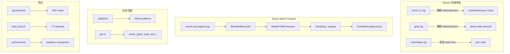

# Design Document: Remaining Issues Fix

## Overview

本设计文档描述 mlx-zig 项目中经 DEEP_VERIFICATION_REPORT.md 审计后剩余未修复问题的技术修复方案。修复范围涵盖四个领域：

1. **Stream 泄漏修复** — `io/mlx_io.zig` 和 `grad.zig` 中的 `defaultStream()` helper 模式导致每次调用创建新的 MLX stream 但不释放；`vision/llava.zig` 测试代码中也存在同样问题
2. **Server Engine Loop 实现** — `server.zig` 的 `engineLoop` 当前是 stub，decode 循环无实际 forward pass 调用，需要接入 `BatchBuilder` 和 `ModelVTable.forward` 实现真正的 batched inference
3. **仓库清理** — 删除意外提交的二进制文件，更新 `.gitignore`，提交文档变更
4. **验证** — 确保 `zig build test`、`scripts/best_test.sh` 7-Prompt 测试、性能基准均通过且无回归

### 设计原则

- **最小侵入性**: stream 泄漏修复仅改变资源管理方式，不改变计算逻辑
- **Zig 惯用模式**: 使用 `defer` 确保 stream 在作用域退出时释放
- **向后兼容**: 所有修复不改变公共 API 签名
- **渐进式实现**: server batch forward 在现有 Scheduler/BatchBuilder 基础上实现，不引入新的抽象

## Architecture

### 修复影响的组件关系



### Stream 生命周期管理策略

当前问题模式：
```
inline fn defaultStream() -> mlx_stream  // 每次调用创建新 stream
mlx_load_safetensors(..., defaultStream())  // stream 传入后无人释放
```

修复后模式：
```
const stream = mlx_default_cpu_stream_new();
defer _ = mlx_stream_free(stream);           // 作用域退出时自动释放
mlx_load_safetensors(..., stream);
```

## Components and Interfaces

### 1. io/mlx_io.zig — Stream 泄漏修复

**当前状态**: `defaultStream()` inline helper 在 `loadSafetensors` 和 `load` 两处被调用，每次创建新 stream 但不释放。

**修复方案**:
- 删除 `defaultStream()` inline helper 函数
- 在 `loadSafetensors` 函数体内创建局部 stream，使用 `defer` 释放
- 在 `load` 函数体内创建局部 stream，使用 `defer` 释放

```zig
// loadSafetensors 修复
pub fn loadSafetensors(allocator: std.mem.Allocator, path: []const u8) !SafetensorsResult {
    const file_z = try allocator.dupeZ(u8, path);
    defer allocator.free(file_z);

    var weights_map = c.c.mlx_map_string_to_array_new();
    defer _ = c.c.mlx_map_string_to_array_free(weights_map);
    var metadata_map = c.c.mlx_map_string_to_string_new();
    defer _ = c.c.mlx_map_string_to_string_free(metadata_map);

    const stream = c.c.mlx_default_cpu_stream_new();  // 新增
    defer _ = c.c.mlx_stream_free(stream);             // 新增
    try c.check(c.c.mlx_load_safetensors(&weights_map, &metadata_map, file_z.ptr, stream));
    // ... 其余不变
}

// load 修复
pub fn load(allocator: std.mem.Allocator, path: []const u8) !Array {
    const file_z = try allocator.dupeZ(u8, path);
    defer allocator.free(file_z);
    const stream = c.c.mlx_default_cpu_stream_new();  // 新增
    defer _ = c.c.mlx_stream_free(stream);             // 新增
    var res = c.c.mlx_array_new();
    try c.check(c.c.mlx_load(&res, file_z.ptr, stream));
    return Array.fromHandle(res);
}
```

### 2. grad.zig — Dead Code 清理

**当前状态**: `defaultStream()` inline helper 存在但在当前代码中**未被任何函数调用**。`valueAndGrad`、`vjp`、`jvp` 三个公共函数都不使用 stream。

**修复方案**: 直接删除 `defaultStream()` 函数定义（第 10-12 行）。这是纯 dead code 清理，不影响任何功能。

### 3. vision/llava.zig — 测试代码 Stream 泄漏

**当前状态**: 第 158 行 `buildModel` 调用中直接传入 `c.c.mlx_default_cpu_stream_new()`，创建的 stream 无人释放。

**修复方案**: 将 stream 创建提取到局部变量，使用 `defer` 释放：

```zig
const stream = c.c.mlx_default_cpu_stream_new();
defer _ = c.c.mlx_stream_free(stream);
const lm_model = try @import("../models/llama_loader.zig").buildModel(allocator, &config, &weights, ctx, stream, null);
```

### 4. server.zig — Engine Loop Batch Forward

**当前状态**: `engineLoop` 函数中的 decode 循环仅检查 `max_tokens` 限制并标记完成，没有实际调用 model forward pass。

**修复方案**: 实现完整的 schedule → build → forward → sample → postprocess 循环：

```zig
fn engineLoop(io: std.Io, state: *ModelState) void {
    while (state.running) {
        var sched = &(state.scheduler.?);
        const scheduled = sched.schedule() catch {
            io.sleep(.fromMilliseconds(10), .awake) catch break;
            continue;
        };

        if (scheduled.isEmpty()) {
            state.allocator.free(scheduled.prefill_requests);
            state.allocator.free(scheduled.decode_requests);
            io.sleep(.fromMilliseconds(1), .awake) catch break;
            continue;
        }

        // 1. Build batched input from scheduled requests
        var batch = batch_builder_mod.build(
            state.allocator, &scheduled, state.ctx
        ) catch |err| {
            std.log.err("engineLoop: batch build failed: {}", .{err});
            // Mark all requests as done with error
            markScheduledRequestsDone(scheduled, state);
            state.allocator.free(scheduled.prefill_requests);
            state.allocator.free(scheduled.decode_requests);
            continue;
        };
        defer batch.deinit();

        if (batch.total_tokens == 0) {
            state.allocator.free(scheduled.prefill_requests);
            state.allocator.free(scheduled.decode_requests);
            continue;
        }

        // 2. Forward pass through model
        const logits = state.vtable.forward(
            state.vtable.ptr,
            batch.batched_tokens,
            batch.attention_mask,
            state.caches,
        ) catch |err| {
            std.log.err("engineLoop: forward pass failed: {}", .{err});
            markScheduledRequestsDone(scheduled, state);
            state.allocator.free(scheduled.prefill_requests);
            state.allocator.free(scheduled.decode_requests);
            continue;
        };
        defer logits.deinit();

        // 3. Sample one token per request from output logits
        const token_outputs = sampleFromLogits(
            state, logits, &scheduled
        ) catch |err| {
            std.log.err("engineLoop: sampling failed: {}", .{err});
            markScheduledRequestsDone(scheduled, state);
            state.allocator.free(scheduled.prefill_requests);
            state.allocator.free(scheduled.decode_requests);
            continue;
        };
        defer state.allocator.free(token_outputs);

        // 4. Postprocess: append tokens, check stop conditions
        sched.postprocess(token_outputs) catch |err| {
            std.log.err("engineLoop: postprocess failed: {}", .{err});
        };

        state.allocator.free(scheduled.prefill_requests);
        state.allocator.free(scheduled.decode_requests);
    }
}
```

**辅助函数**:

- `sampleFromLogits(state, logits, scheduled)` — 从 logits tensor 中为每个 request 提取最后一个 token 位置的 logits，执行 argmax（temperature=0 时）或采样，返回 `[]TokenOutput`
- `markScheduledRequestsDone(scheduled, state)` — 错误恢复：将所有 scheduled requests 标记为 done

### 5. e2e_server.sh — 测试脚本对齐

**当前状态**: `e2e_server.sh` 包含 12 个测试用例，但与 `best_test.sh` 的 7 个核心 prompt 不完全对齐（prompt 措辞和 max_tokens 不同）。

**修复方案**:
- 在脚本开头添加 7 个核心 prompt 测试（与 `best_test.sh` 完全一致的 prompt 和 expected 匹配模式）
- 保留现有扩展测试
- 分别统计核心 prompt 通过率和扩展测试通过率
- 核心 prompt 任一失败则脚本返回非零退出码

### 6. .gitignore 和二进制清理

**修复方案**:
- `git rm` 删除 `check_types`, `main`, `test_arr`, `test_fs`, `test_fs2`, `test_mlx_c`, `test_try` 等二进制文件（如果存在于 git 跟踪中）
- 在 `.gitignore` 中添加通用二进制排除模式：
  ```
  # Compiled test/debug binaries
  check_types
  main
  test_arr
  test_fs
  test_fs2
  test_mlx_c
  test_try
  test_random
  test_remap_standalone
  test_mlx_take_zero
  ```

## Data Models

### Stream 资源模型

MLX stream 是 C API 中的不透明句柄，遵循 create/free 生命周期：

```
mlx_stream handle = mlx_default_cpu_stream_new()  // 引用计数 +1
mlx_stream_free(handle)                            // 引用计数 -1, 归零时释放
```

每个 stream 对象在 MLX 内部持有设备引用和调度队列。泄漏的 stream 不会导致计算错误，但会累积内存占用。在 server 长时间运行场景下，`loadSafetensors` 每次加载 safetensors 文件都会泄漏一个 stream。

### BatchResult 数据结构

```
BatchResult {
    batched_tokens: Array [total_tokens]        // 所有 request 的 token 拼接
    position_ids:   Array [total_tokens]        // 每个 token 的位置索引
    attention_mask: Array [total_tokens × total_tokens]  // 因果 + 请求隔离 mask
    total_tokens:   usize                       // batch 中总 token 数
    num_requests:   usize                       // batch 中请求数
}
```

### TokenOutput 数据结构

```
TokenOutput {
    request_id: u64    // 对应的 request ID
    token:      u32    // 采样得到的 token
}
```

### ScheduleResult 数据结构

```
ScheduleResult {
    prefill_requests:  []*Request   // 需要 prefill 的请求
    decode_requests:   []*Request   // 需要 decode 的请求
    blocks_needed:     usize        // 等待中请求需要的 block 数
}
```


## Correctness Properties

**PBT 不适用于本特性。**

本特性的修复内容主要涉及：

1. **资源管理（Stream 泄漏修复）** — 修复的核心是确保 `mlx_stream_free` 在每个 `mlx_default_cpu_stream_new` 之后被调用。这是代码模式正确性，不是可以用不同输入验证的纯函数行为。stream 的创建和释放是幂等的副作用操作，不存在"对于所有输入 X，性质 P(X) 成立"的通用量化。

2. **基础设施接线（Server Engine Loop）** — engine loop 的实现涉及网络 I/O、模型 forward pass（GPU 计算）、异步调度等外部依赖。BatchBuilder 和 Scheduler 已有独立的单元测试覆盖。engine loop 本身是这些组件的集成层，适合用集成测试（e2e_server.sh）验证。

3. **仓库清理** — 文件系统操作和 git 操作，不涉及可测试的代码逻辑。

4. **验证步骤** — 运行现有测试套件和基准测试，本身就是测试活动。

**替代测试策略**: 使用现有的单元测试（`zig build test`）、端到端测试（`best_test.sh`、`e2e_server.sh`）和性能基准测试来验证修复的正确性。详见下方 Testing Strategy 部分。

## Error Handling

### Stream 泄漏修复的错误处理

Stream 泄漏修复不引入新的错误路径。`defer` 语句确保即使函数中途返回错误，stream 也会被释放。这是 Zig 的标准资源管理模式：

```zig
const stream = c.c.mlx_default_cpu_stream_new();
defer _ = c.c.mlx_stream_free(stream);
// 即使下面的 c.check() 返回错误，defer 也会执行
try c.check(c.c.mlx_load_safetensors(&weights_map, &metadata_map, file_z.ptr, stream));
```

### Server Engine Loop 错误处理

Engine loop 中的每个阶段都需要独立的错误处理，避免单个请求的失败影响整个循环：

| 阶段 | 错误类型 | 处理策略 |
|------|---------|---------|
| `schedule()` | 内存分配失败 | 短暂 sleep 后重试 |
| `batch_builder.build()` | 内存分配、数组创建失败 | 标记所有 scheduled requests 为 done（error state），继续循环 |
| `model.forward()` | GPU 错误、内存不足 | 标记所有 scheduled requests 为 done（error state），log 错误，继续循环 |
| `sampleFromLogits()` | 数组操作失败 | 标记所有 scheduled requests 为 done（error state），继续循环 |
| `scheduler.postprocess()` | 内存分配失败 | log 错误，继续循环（请求可能处于不一致状态，但不会 crash） |

**关键设计决策**: engine loop 永远不应 panic 或退出。所有错误都通过 log + 标记请求失败来处理，确保 server 进程持续运行。

### 错误恢复辅助函数

```zig
fn markScheduledRequestsDone(scheduled: scheduler_mod.ScheduleResult, state: *ModelState) void {
    for (scheduled.prefill_requests) |req| {
        req.markComplete();
        req.state = .done;
    }
    for (scheduled.decode_requests) |req| {
        req.markComplete();
        req.state = .done;
    }
}
```

## Testing Strategy

### 测试层次

本特性采用三层测试策略：

#### 1. 单元测试 (`zig build test`)

- **覆盖范围**: 430+ 现有测试 + stream 泄漏修复后的回归验证
- **验证目标**: 修复不引入编译错误或逻辑回归
- **执行方式**: `zig build test`，期望 exit code 0
- **注意**: stream 泄漏本身难以通过单元测试直接检测（需要 leak sanitizer），但确保修复后所有现有测试仍然通过

#### 2. 端到端测试 (`best_test.sh` + `e2e_server.sh`)

- **best_test.sh**: 7 个核心 prompt 的 CLI 模式正确性验证
  - P1: 2+2= → 4
  - P2: Capital of France (completion) → Paris
  - P3: Water freezes → 0
  - P4: Earth round → yes
  - P5: 3*3= → 9
  - P6: 10-5= → answer is 5
  - P7: Capital of France (question) → Paris
  - 期望: 7/7 PASS

- **e2e_server.sh**: 服务器模式端到端测试
  - 包含与 `best_test.sh` 对齐的 7 个核心 prompt
  - 额外包含扩展测试（地理、科学、语言、代码、历史）
  - 核心 prompt 通过率单独统计
  - 期望: 核心 7/7 PASS

#### 3. 性能基准测试

- **基线数据** (来自 PERFORMANCE_BENCHMARK.md):
  - Prefill: 170ms
  - 稳态 token 延迟: ~41ms/token
  - 吞吐量: ~23 tok/s
- **容忍范围**: ±20%
  - Prefill: ≤ 204ms
  - 稳态: ≤ 49ms/token
  - 吞吐量: ≥ 18.4 tok/s
- **执行方式**: 使用 `best_test.sh` 的输出计时或专用 benchmark 脚本

### 为什么不使用 Property-Based Testing

如上文 Correctness Properties 部分所述，本特性的修复内容不适合 PBT：

- **Stream 泄漏修复**: 资源管理的正确性是代码模式问题（`defer` + `free`），不是可以用随机输入验证的函数行为
- **Server Engine Loop**: 涉及 GPU forward pass、网络 I/O、异步调度等外部依赖，PBT 的 100+ 次迭代成本过高且不会比 2-3 次集成测试发现更多 bug
- **仓库清理**: 文件系统操作，不涉及可测试的代码逻辑
- **BatchBuilder/Scheduler**: 已有独立的单元测试覆盖，本特性不修改其核心逻辑

### 测试执行顺序

1. `zig build test` — 确保编译和单元测试通过
2. `zig build -Doptimize=ReleaseFast` — 构建优化版本
3. `scripts/best_test.sh` — CLI 模式 7-Prompt 验证
4. `scripts/e2e_server.sh` — Server 模式端到端验证
5. 性能基准对比 — 确认无回归
