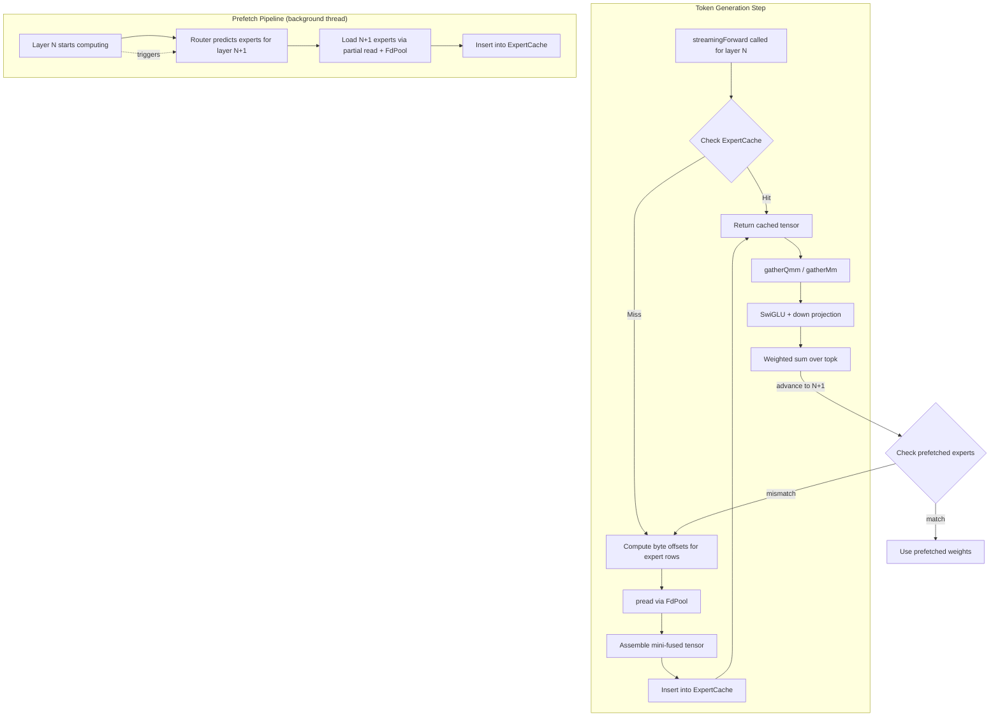
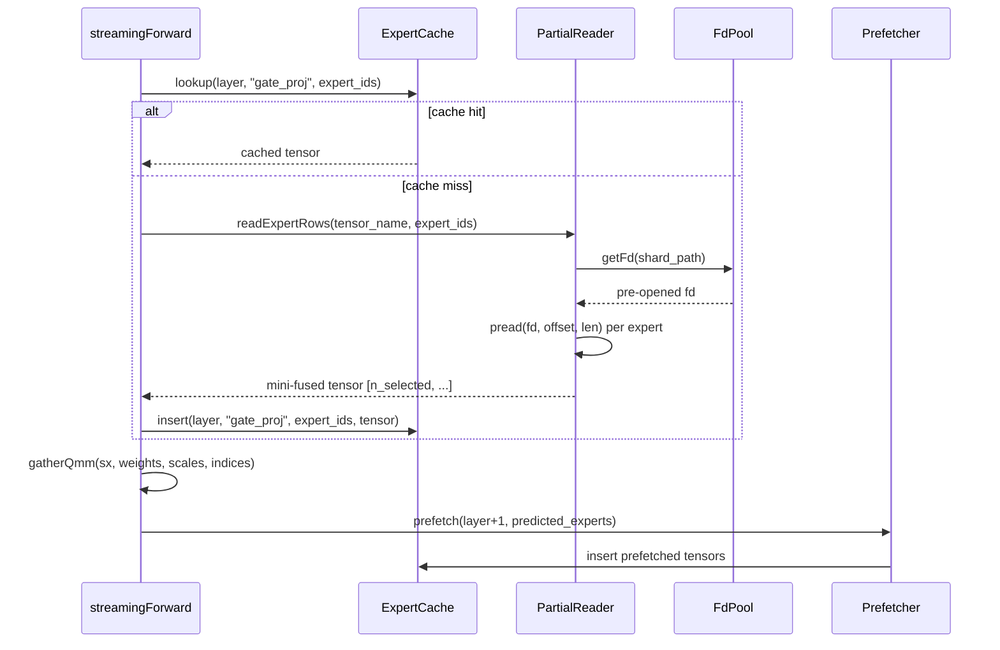

# Design: Stream Mode Performance Optimizations

## Overview

Stream mode currently generates correct output but takes 10+ minutes per token because every forward pass reloads all needed expert weights from disk. This design introduces four interlocking optimizations to reduce per-token latency from minutes to seconds:

1. **Expert Weight LRU Cache** — retain recently loaded expert slices in memory across token steps, eliminating redundant disk reads for experts reused between adjacent tokens.
2. **Per-Expert Sliced Tensor Loading** — read only the byte ranges for selected expert rows from fused tensors on disk, reducing per-tensor I/O from ~256MB to ~4-8MB.
3. **File Descriptor Pooling** — open shard file descriptors once at initialization and reuse them, eliminating repeated open/close syscall overhead.
4. **Asynchronous Layer Prefetching** — overlap disk reads for the next MoE layer's experts with GPU computation for the current layer.

These optimizations compose: the cache check happens first, cache misses trigger partial reads through pooled file descriptors, and prefetching fills the cache for the next layer while the current layer computes.

### Design Rationale

The current `streamingForward` in `expert_stream.zig` calls `loadExpertSlices`, which loads the *full* fused tensor via `TensorIndex.loadTensor()` then slices with `takeAxis`. For DeepSeek V4 Flash 4-bit with 256 experts, each fused tensor is ~256MB. With 6 projections per layer (gate, up, down + 3 scales) and ~4 unique experts per token step, that's ~6GB of disk reads per layer, ~258GB across 43 layers — per token.

The optimizations target each bottleneck:
- **Cache**: Experts reused across tokens (common — router selections are sticky) skip disk entirely.
- **Partial reads**: Cache misses read ~1MB per expert row instead of ~256MB per full tensor.
- **FD pooling**: Eliminates ~1720 open/close pairs per token step.
- **Prefetching**: Hides remaining disk latency behind GPU compute.

## Architecture



### Component Interaction



## Components and Interfaces

### 1. ExpertCache

LRU cache storing individual expert weight slices keyed by `(layer_index, tensor_name, expert_id)`.

```zig
pub const ExpertCache = struct {
    pub const CacheKey = struct {
        layer_idx: u32,
        tensor_name_hash: u64,  // hash of tensor name string
        expert_id: u32,
    };

    pub const CacheEntry = struct {
        key: CacheKey,
        tensor: Array,
        byte_size: usize,
        /// Position in LRU doubly-linked list
        lru_prev: ?*CacheEntry,
        lru_next: ?*CacheEntry,
    };

    allocator: std.mem.Allocator,
    map: std.AutoHashMap(CacheKey, *CacheEntry),
    max_bytes: usize,
    current_bytes: usize,
    hits: u64,
    misses: u64,

    /// LRU list: head = most recently used, tail = least recently used
    lru_head: ?*CacheEntry,
    lru_tail: ?*CacheEntry,

    pub fn init(allocator: std.mem.Allocator, max_bytes: usize) ExpertCache;
    pub fn deinit(self: *ExpertCache) void;

    /// Look up a cached expert tensor. Returns null on miss.
    /// On hit, moves entry to head of LRU list.
    pub fn get(self: *ExpertCache, key: CacheKey) ?Array;

    /// Insert a tensor into the cache. Evicts LRU entries if needed.
    /// If the tensor is larger than max_bytes, returns without caching.
    pub fn put(self: *ExpertCache, key: CacheKey, tensor: Array, byte_size: usize) void;

    /// Evict least-recently-used entries until at least `needed_bytes` are free.
    fn evictUntil(self: *ExpertCache, needed_bytes: usize) void;

    /// Report current stats.
    pub fn stats(self: *const ExpertCache) CacheStats;
};

pub const CacheStats = struct {
    hits: u64,
    misses: u64,
    current_bytes: usize,
    max_bytes: usize,
    entry_count: usize,
};
```

**Design decisions:**
- Cache granularity is per-expert-per-projection (not per-layer). This allows partial reuse when some experts from a layer are cached and others aren't.
- The key uses a hash of the tensor name rather than storing the string, keeping the hash map compact.
- LRU is implemented as a doubly-linked list threaded through `CacheEntry` nodes, giving O(1) promotion and eviction.
- Default budget is 4GB, configurable at init. With ~1MB per expert slice, this holds ~4000 entries — roughly 15 layers' worth of experts at 6 experts per layer × 6 projections.

### 2. PartialTensorReader

Reads individual expert rows from fused tensors on disk using byte-offset pread.

```zig
pub const PartialTensorReader = struct {
    allocator: std.mem.Allocator,
    index: *TensorIndex,
    fd_pool: *FdPool,

    pub fn init(
        allocator: std.mem.Allocator,
        index: *TensorIndex,
        fd_pool: *FdPool,
    ) PartialTensorReader;

    /// Read a single expert's row from a fused tensor.
    /// Returns an Array with shape [1, dim1, dim2, ...] (the expert's slice along axis 0).
    ///
    /// For mxfp4 quantized tensors, the read is aligned to group boundaries.
    pub fn readExpertRow(
        self: *PartialTensorReader,
        tensor_name: []const u8,
        expert_id: u32,
    ) !Array;

    /// Read multiple expert rows and assemble into a mini-fused tensor.
    /// Returns an Array with shape [n_experts, dim1, dim2, ...].
    pub fn readExpertRows(
        self: *PartialTensorReader,
        tensor_name: []const u8,
        expert_ids: []const u32,
    ) !Array;

    /// Compute byte offset and length for a single expert row within a fused tensor.
    /// Accounts for mxfp4 group alignment.
    fn computeExpertByteRange(
        self: *PartialTensorReader,
        info: *const TensorInfo,
        expert_id: u32,
    ) struct { offset: u64, length: usize };
};
```

**Byte offset calculation:**

For a fused tensor with shape `[n_experts, D1, D2, ...]` and dtype size `elem_bytes`:
- `row_elements = D1 * D2 * ...`
- `row_bytes = row_elements * elem_bytes`
- `expert_offset = info.data_offset_start + expert_id * row_bytes`

For mxfp4 (4-bit packed), the on-disk representation packs 2 values per byte with group_size=32:
- The packed row size is `row_elements / 2` bytes for the weight data
- Scale tensors have their own shape and are read separately
- Expert rows are contiguous along axis 0, so the offset calculation is the same — just using the packed row size

**Design decisions:**
- Individual expert rows are read with separate pread calls rather than a single scatter-gather read. On macOS with APFS and NVMe SSDs, individual 1MB preads are efficient and the kernel coalesces nearby reads.
- The reader returns MLX Arrays directly, created via `mlx_array_new_data` from the pread buffer.
- For mxfp4, we read the exact packed bytes for each expert row. Since expert rows are contiguous along axis 0 in the fused tensor, and the packing is within each row, partial reads preserve the packing format correctly.

### 3. FdPool

Pool of pre-opened file descriptors for shard files.

```zig
pub const FdPool = struct {
    allocator: std.mem.Allocator,
    /// Map from shard file path to open file descriptor
    fds: std.StringHashMap(std.posix.fd_t),

    pub fn init(allocator: std.mem.Allocator) FdPool;

    /// Open all shard files referenced by the tensor index.
    pub fn openAll(self: *FdPool, index: *TensorIndex) !void;

    /// Get the file descriptor for a shard path.
    pub fn getFd(self: *FdPool, shard_path: []const u8) !std.posix.fd_t;

    /// Close all open file descriptors.
    pub fn deinit(self: *FdPool) void;
};
```

**Design decisions:**
- Uses Zig's `std.posix` for fd management rather than raw C imports, aligning with Zig idioms where possible. Falls back to C `open`/`pread`/`close` if needed for compatibility with the existing codebase.
- The pool is populated eagerly at initialization by iterating unique shard paths from `TensorIndex.entries`. With 33 shards, this opens 33 file descriptors — well within OS limits.
- Thread-safe by design: pread is thread-safe (no shared file offset), so multiple threads can read from the same fd concurrently.

### 4. LayerPrefetcher

Background thread that prefetches expert weights for the next layer.

```zig
pub const LayerPrefetcher = struct {
    allocator: std.mem.Allocator,
    reader: *PartialTensorReader,
    cache: *ExpertCache,
    layer_meta: []const LayerExpertMeta,

    /// Background thread handle
    thread: ?std.Thread,
    /// Mutex protecting shared state
    mutex: std.Thread.Mutex,
    /// Signal to wake the prefetch thread
    condition: std.Thread.Condition,

    /// Request state
    request_layer: ?usize,
    request_expert_ids: ?[]const u32,
    request_done: bool,
    should_stop: bool,

    pub fn init(
        allocator: std.mem.Allocator,
        reader: *PartialTensorReader,
        cache: *ExpertCache,
        layer_meta: []const LayerExpertMeta,
    ) !LayerPrefetcher;

    /// Request prefetch of experts for a given layer.
    /// Non-blocking: queues the request for the background thread.
    pub fn prefetch(self: *LayerPrefetcher, layer_idx: usize, expert_ids: []const u32) void;

    /// Wait for the current prefetch to complete.
    /// Called when advancing to the prefetched layer.
    pub fn waitForCompletion(self: *LayerPrefetcher) void;

    /// Stop the background thread.
    pub fn deinit(self: *LayerPrefetcher) void;

    /// Background thread entry point.
    fn prefetchWorker(self: *LayerPrefetcher) void;
};
```

**Design decisions:**
- Single background thread with a condition variable for wake-up. This is simpler than a thread pool and sufficient since we only prefetch one layer ahead.
- The prefetcher loads all 6 projections (gate, up, down + scales) for the predicted experts and inserts them into the ExpertCache.
- Memory budget: one layer's worth of experts is ~6 experts × 6 projections × ~1MB = ~36MB. This is well within the cache budget and doesn't require separate memory tracking.
- If the router's actual selections differ from predictions, the cache still holds whatever was prefetched (useful if there's overlap), and missing experts are loaded synchronously.

### 5. Updated ExpertStreamProvider

The existing `ExpertStreamProvider` is extended with the new components:

```zig
pub const ExpertStreamProvider = struct {
    // ... existing fields ...

    // New performance fields
    cache: ?*ExpertCache,
    fd_pool: ?*FdPool,
    partial_reader: ?*PartialTensorReader,
    prefetcher: ?*LayerPrefetcher,

    // Diagnostic counters
    total_bytes_read: u64,
    token_step_count: u64,
    token_step_start_ns: i128,
};
```

The `streamingForward` method is updated to:
1. Check cache for each required projection
2. On miss, use `PartialTensorReader` to load only needed expert rows
3. Insert loaded tensors into cache
4. Kick off prefetch for layer N+1
5. Log diagnostics at token step boundaries

## Data Models

### Cache Key Structure

```
CacheKey {
    layer_idx: u32,           // 0..42 for DeepSeek V4
    tensor_name_hash: u64,    // std.hash.Wyhash of tensor name
    expert_id: u32,           // 0..255
}
```

Total key space: 43 layers × 6 projections × 256 experts = 66,048 possible entries. At ~1MB per entry, the full space would be ~66GB. The 4GB cache holds ~4000 entries (~6% of the space).

### Expert Byte Layout in Fused Tensors

For DeepSeek V4 Flash 4-bit, the fused expert tensors have these shapes:

| Tensor | Shape | Dtype | Row bytes | Total bytes |
|--------|-------|-------|-----------|-------------|
| gate_proj.weight | [256, 2048, 256] | uint8 (mxfp4 packed) | 524,288 | 134,217,728 (~128MB) |
| up_proj.weight | [256, 2048, 256] | uint8 (mxfp4 packed) | 524,288 | 134,217,728 (~128MB) |
| down_proj.weight | [256, 4096, 128] | uint8 (mxfp4 packed) | 524,288 | 134,217,728 (~128MB) |
| gate_proj.scales | [256, 2048, 8] | bfloat16 | 32,768 | 8,388,608 (~8MB) |
| up_proj.scales | [256, 2048, 8] | bfloat16 | 32,768 | 8,388,608 (~8MB) |
| down_proj.scales | [256, 4096, 4] | bfloat16 | 32,768 | 8,388,608 (~8MB) |

Per-expert row sizes:
- Weight: ~512KB per expert per projection
- Scale: ~32KB per expert per projection
- Total per expert (all 6 tensors): ~3 × 512KB + 3 × 32KB ≈ **1.6MB**

For 6 selected experts per layer: ~9.6MB of I/O per layer (vs ~768MB currently loading full tensors).

### Memory Budget Breakdown

| Component | Size | Notes |
|-----------|------|-------|
| Backbone + attention + shared expert | ~10GB | Fixed, loaded at init |
| Expert cache (default) | 4GB | Configurable, LRU managed |
| Prefetch buffer | ~36MB | One layer's experts |
| FD pool | ~33 fds | Negligible memory |
| Working memory (MLX arrays) | ~1-2GB | Intermediate computation |
| **Total** | **~15-16GB** | Well under 20GB target |

### Diagnostic Metrics

```zig
pub const TokenStepMetrics = struct {
    step_number: u64,
    wall_clock_ms: f64,
    bytes_read: u64,
    cache_hits: u64,
    cache_misses: u64,
    cache_memory_bytes: usize,
    prefetch_hits: u64,      // experts found from prefetch
    prefetch_misses: u64,    // experts that needed sync load despite prefetch
};
```


## Correctness Properties

*A property is a characteristic or behavior that should hold true across all valid executions of a system — essentially, a formal statement about what the system should do. Properties serve as the bridge between human-readable specifications and machine-verifiable correctness guarantees.*

### Property 1: Cache round-trip

*For any* valid cache key (layer_idx, tensor_name, expert_id) and any tensor value, inserting the tensor into the ExpertCache via `put()` and then retrieving it via `get()` with the same key SHALL return the original tensor, provided no eviction has occurred for that key.

**Validates: Requirements 1.1, 1.2**

### Property 2: LRU eviction order

*For any* sequence of `put()` and `get()` operations on an ExpertCache with a fixed memory budget, when a `put()` triggers eviction, the evicted entry SHALL be the one whose most recent access (via `put()` or `get()`) is oldest among all entries in the cache.

**Validates: Requirements 1.3**

### Property 3: Cache memory tracking invariant

*For any* sequence of `put()`, `get()`, and eviction operations on an ExpertCache, the `current_bytes` field SHALL equal the sum of `byte_size` of all entries currently in the cache, and `current_bytes` SHALL never exceed `max_bytes`.

**Validates: Requirements 1.4**

### Property 4: Cache hit/miss counter accuracy

*For any* sequence of `get()` operations on an ExpertCache, `hits + misses` SHALL equal the total number of `get()` calls, where `hits` counts calls that returned a cached tensor and `misses` counts calls that returned null.

**Validates: Requirements 1.7**

### Property 5: Expert byte offset computation with mxfp4 alignment

*For any* fused tensor with shape `[n_experts, D1, D2, ...]` and any valid expert_id in `[0, n_experts)`, the computed byte offset SHALL equal `data_offset_start + expert_id * row_bytes` and the computed length SHALL equal `row_bytes`. When the quantization format is mxfp4, the byte offset and length SHALL be aligned to mxfp4 group boundaries (multiples of `group_size / 2` bytes).

**Validates: Requirements 2.1, 2.3**

### Property 6: Mini-fused tensor assembly correctness

*For any* set of expert IDs `[e0, e1, ..., eN]` and a fused tensor with known data, assembling the expert rows into a mini-fused tensor SHALL produce a tensor with shape `[N+1, D1, D2, ...]` where row `i` of the result contains the data from expert `e_i` of the original fused tensor.

**Validates: Requirements 2.4**

### Property 7: FdPool provides valid fds for all indexed shards

*For any* TensorIndex containing entries referencing shard files, after `FdPool.openAll()`, calling `getFd(shard_path)` for every unique shard path in the index SHALL return a valid (non-negative) file descriptor, and multiple calls with the same path SHALL return the same fd.

**Validates: Requirements 3.1, 3.2**

### Property 8: Numerical equivalence with unoptimized path

*For any* input tensor and expert selection indices, the optimized `streamingForward` (with cache, partial reads, and FD pooling) SHALL produce output that is bitwise identical to the current unoptimized `streamingForward` implementation.

**Validates: Requirements 5.3**

## Error Handling

### Cache Errors

| Error Condition | Handling |
|----------------|----------|
| Tensor larger than cache budget | `put()` silently skips caching; tensor is used directly and not retained. Logged at debug level. |
| Cache allocation failure | `put()` attempts eviction first. If still insufficient, skips caching. Does not propagate error — cache is best-effort. |

### Partial Read Errors

| Error Condition | Handling |
|----------------|----------|
| pread returns fewer bytes than expected | Returns `error.IncompleteRead` with the tensor name and expected vs actual byte count. |
| Tensor not found in index | Returns `error.TensorNotFound`. |
| Invalid expert_id (>= n_experts) | Returns `error.ExpertIdOutOfRange`. |
| Byte offset exceeds file size | Caught by pread returning short read → `error.IncompleteRead`. |

### FdPool Errors

| Error Condition | Handling |
|----------------|----------|
| Shard file not found during openAll() | Returns `error.FileNotFound` with the shard path. Initialization fails — all shards must be accessible. |
| getFd for unknown shard path | Returns `error.ShardNotInPool`. This indicates a bug — all shard paths should be opened at init. |
| Too many open files (EMFILE) | Propagated as `error.TooManyOpenFiles`. Unlikely with 33 shards. |

### Prefetcher Errors

| Error Condition | Handling |
|----------------|----------|
| Prefetch read failure | Logged at warning level. The prefetched entries are not inserted into cache. The main thread will load them synchronously on cache miss. |
| Thread spawn failure | Prefetcher is disabled. All loads happen synchronously. Logged at warning level. |
| Prefetch for invalid layer | Ignored (no-op). Logged at debug level. |

### Graceful Degradation

The system is designed to degrade gracefully:
- If the cache is disabled (budget = 0), every access is a cache miss → falls back to partial reads.
- If partial reads fail, the system can fall back to full tensor loading via `TensorIndex.loadTensor()` (current behavior).
- If the prefetcher fails to start, all loads are synchronous — slower but correct.
- If the FdPool fails, individual reads can open/close fds per-read (current behavior).

## Testing Strategy

### Property-Based Tests

Property-based testing is appropriate for this feature because the core components (cache, byte offset computation, tensor assembly) are pure functions or have clear input/output behavior with large input spaces.

**Library**: Zig's built-in `std.Random` for input generation with manual property assertions (same pattern used in `moe_router.zig` Property 18 test). Each test runs **100 iterations minimum**.

**Tag format**: `Feature: stream-mode-performance, Property {N}: {title}`

Tests to implement:

1. **Property 1 test**: Generate random cache keys and mock tensors (random byte sizes). Insert via `put()`, retrieve via `get()`, verify round-trip. Vary cache budget, number of entries, and access patterns.

2. **Property 2 test**: Generate random sequences of `put()`/`get()` operations on a small-budget cache. Track access timestamps manually. After each eviction-triggering `put()`, verify the evicted entry was the LRU one by checking which key is no longer retrievable.

3. **Property 3 test**: Generate random operation sequences. After each operation, verify `current_bytes` equals the sum of all entry sizes. Verify `current_bytes <= max_bytes` always holds.

4. **Property 4 test**: Generate random sequences of `put()`/`get()` operations. After each `get()`, verify `hits + misses` equals total `get()` count.

5. **Property 5 test**: Generate random tensor shapes `[n_experts, D1, D2]` with random dtypes (uint8 for mxfp4, bfloat16 for scales). For random expert IDs, verify offset = `data_offset_start + expert_id * row_bytes` and verify mxfp4 alignment.

6. **Property 6 test**: Create a test fused tensor with known data (e.g., expert `i` has all values = `i`). Select random subsets of expert IDs. Assemble mini-fused tensor and verify each row matches the corresponding expert's data.

7. **Property 7 test**: Create temporary safetensors files with known headers. Build a TensorIndex, call `FdPool.openAll()`, verify `getFd()` returns valid fds for all shard paths. Verify idempotency (same fd on repeated calls).

8. **Property 8 test**: This is an integration-level property test. Create small mock expert tensors on disk. Run both the old `loadExpertSlices` (full load + slice) and the new partial-read path with the same inputs. Verify outputs are bitwise identical. Run with random expert selections across 100 iterations.

### Unit Tests (Example-Based)

- Cache initialization with default and custom budgets (Req 1.5)
- Cache bypass for oversized tensors (Req 1.6)
- Incomplete pread error handling (Req 2.6)
- FdPool error on missing shard file (Req 3.4)
- Prefetch memory limit (Req 4.4)
- Diagnostic metrics population (Req 6.1, 6.2, 6.3)

### Integration Tests

- End-to-end streamingForward with cache + partial reads + FdPool (Req 5.1, 5.2)
- Prefetch pipeline with matching and mismatching expert predictions (Req 4.1, 4.2, 4.3)
- Full token generation with all optimizations active (Req 5.4, 5.5)

### Smoke Tests

- FdPool cleanup on deinit (Req 3.3)
- Token generation latency < 30s (Req 5.4)
- Peak memory < 20GB (Req 5.5)
